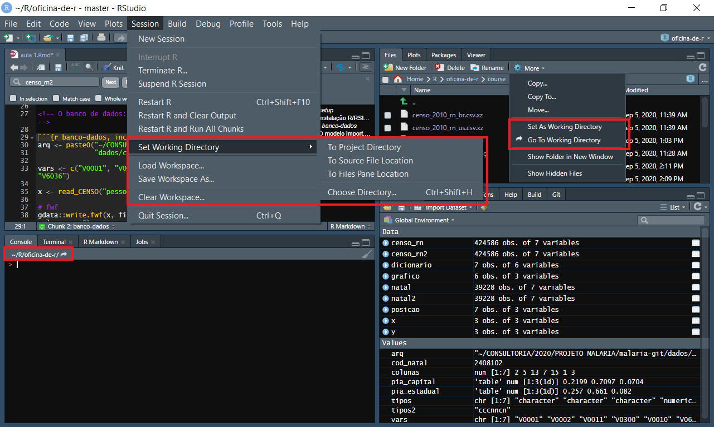
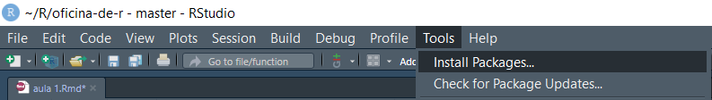
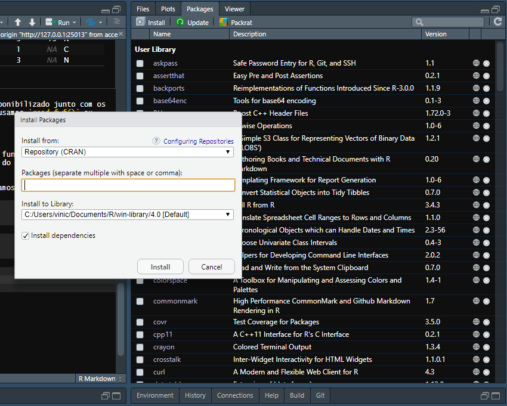
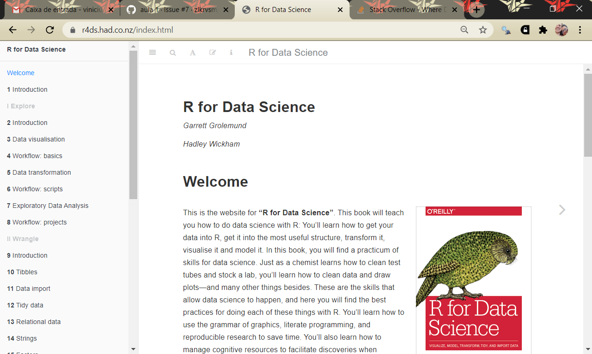
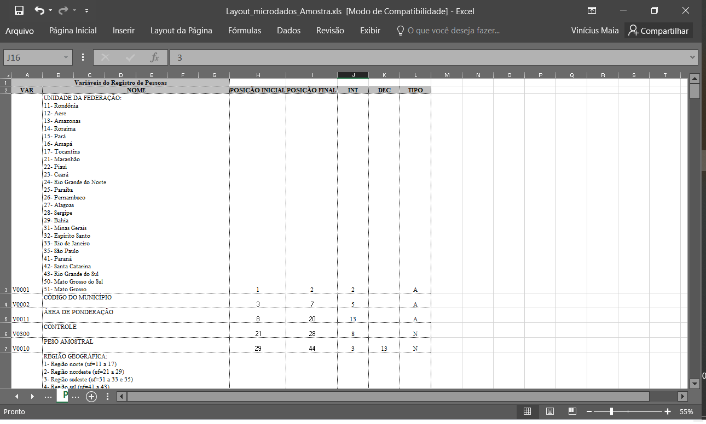

```{r setup, include=FALSE}
library(knitr)
library(rmarkdown)
library(tidyverse)
library(microdadosBrasil)
opts_chunk$set(echo = TRUE)
options(scipen = 999)
```


# Instalação R/RStudio/RStudio Cloud

O R Base pode ser instalado no site [Comprehensive R Archive Network][1] (link para o windows, mas também é possível instalar para Linux e Mac).

O RStudio é uma interface gráfica para facilitar o trabalho com o R, e pode ser obtido no site da [Fundação RStudio][2] (que na verdade é uma empresa).

Caso seu computador seja muito antigo ou você não possa/queira instalar o R e o RStudio, você pode realizar o curso a partir do [RStudio Cloud][3], onde você pode rodar código R em um servidor remoto, a partir do seu navegador. É preciso criar uma conta, mas uma vez que você entre e crie um projeto, é bem parecido com o RStudio no seu computador.

<!-- O banco de dados: Censo 2010, RN, Controle + Idade + Sexo -->

```{r banco-dados, include=FALSE, eval=FALSE}
arq <- paste0("~/CONSULTORIA/2020/PROJETO MALARIA/malaria-git/",
              "dados/cd10/RN/Amostra_Pessoas_24.txt")

vars <- c("V0001", "V0002", "V0011", "V0300", "V0010", "V0601", "V6036")

x <- read_CENSO("pessoas", 2010, file = arq, vars_subset = vars)

# fwf
gdata::write.fwf(x, file = "censo_2010_rn.txt", sep = "", colnames = F)

# csv us
write_csv(x, "censo_2010_rn_us.csv.xz")

# csv br
write_csv2(x, "censo_2010_rn_br.csv.xz")
```

# O modelo import, tidy, transform, visualize, model, communicate

Existe uma sequência de atividades que nós precisamos efetuar sempre que trabalhamos com dados. Esta sequência foi sistematizada, por exemplo, por [Wickham & Grolemund][4] no seguinte diagrama.

```{r, echo = FALSE}
include_graphics("data-science-explore.png")
```

É uma forma simplificada e genérica de descrever a sequência de operações que são necessárias pra transformar dado bruto em dado processado, analisado, transformado, modelado, visualizado e eventualmente disponibilizado para o público. Vou me referir a esse processo a partir de agora como se fosse uma tubulação, ou pipeline, pelas quais os dados precisam passar até que eles cheguem em um estado final definido por nós como adequado.

# Data pipeline

## Importação

A primeira fase de qualquer operação com dados é a importação de um formato externo, os mais comuns são o formato "largura-fixa" (Censo Demográfico, PNAD) e CSV (separado por ";" ou ","), mas também é possível importar arquivos do Excel, STATA, SPSS, SAS e praticamente qualquer outro formato comum.

Vamos começar importando um pedacinho do Censo 2010 do estado mais mentiroso da federação: o Rio Grande do Norte.

```{r}
readLines("censo_2010_rn.txt", n = 10)
```

***

**Pasta de trabalho**

Você pode ter tido um problema ao tentar ler o arquivo aqui. Talvez o R não tenha encontrado o arquivo que você está tentando ler. O R possui um conceito poderoso chamado *pasta de trabalho*. A ideia é que ele vai sempre procurar os arquivos nessa pasta, e você pode acessar e mudar essa pasta como você quiser.

```{r, eval=FALSE}
# descubra sua pasta de trabalho atual
getwd()

# mude sua pasta para outra
setwd("~/R/oficina-de-r/course/")
```

Também é possível acessar/alterar sua pasta de trabalho através da interface do RStudio:

```{r, echo=FALSE}

```
***

Podemos usar `readLines()` pra ver "a cara" de um arquivo qualquer, especificando que leremos `n = 10` linhas. Como vocês podem ver, não dá pra ler esse arquivo "sozinho", precisamos saber onde começam e terminam as colunas. Nesse caso, o dicionário é o seguinte:

```{r}
dicionario <- tribble(
  ~Variavel, ~PosIni, ~PosFim, ~Int, ~Dec, ~Tipo,
  "V0001", 1, 2, 2, NA, "A",
  "V0002", 3, 7, 5, NA, "A",
  "V0011", 8, 20, 13, NA, "A",
  "V0300", 21, 27, 8, NA, "N",
  "V0010", 28, 42, 3, 12, "N",
  "V0601", 43, 43, 1, NA, "C",
  "V6036", 44, 46, 3, NA, "N"
)
dicionario
```

Esse tipo de dicionário de dados é geralmente disponibilizado junto com os microdados. Pra importar um arquivo desses no R, usamos `read.fwf()` ou `read_fwf()` do pacote `readr`.

***

**Pacotes** são extensões do software R base e contém funções extras ou melhorias. São uma parte essencial do ecossistema do R e vamos utilizar vários deles por aqui.

Existem três formas de instalar um pacote no R. Vamos vê-las.

```{r, eval=FALSE}
install.packages("readr")
```

```{r, echo=FALSE}

```

```{r, echo=FALSE}

```

Depois de instalado, é só carregar o pacote no início do seu código com:

```{r, eval=FALSE}
library(readr)
```

***

Voltando a importação, pegamos a largura das colunas.

```{r}
colunas <- c(2, 5, 13, 7, 15, 1, 3)
colunas
```

Os tipos das colunas.

```{r}
tipos <- c("character", "character", "character", "numeric", "numeric", "character", "numeric")
tipos
```


E passamos pra `read.fwf()`

```{r}
censo_rn <- read.fwf(file = "censo_2010_rn.txt", 
                     widths = colunas, 
                     colClasses = tipos)
head(censo_rn)
```

Ou, algo parecido, para `read_fwf()`

```{r}
posicao <- fwf_widths(c(2, 5, 13, 7, 15, 1, 3))

tipos2 <- "cccnncn"

censo_rn2 <- read_fwf(file = "censo_2010_rn.txt",
                      col_positions = posicao,
                      col_types = tipos2)
head(censo_rn2)
```

De uma maneira geral, não há motivo hoje em dia pra usar `base::read.fwf()` se você puder usar o `readr::read_fwf()`, o segundo é mais rápido e mais flexível.

***

**Workflow**

Pra muitos de nós, usar um programa consista em abrir aquele programa e simplesmente usar ele. Talvez você abra seu Excel e simplesmente trabalhe ali o tempo todo, talvez você consulte um ou outro documento aqui e ali.

Trabalhar no R tem um workflow muito diferente. Em geral, você vai ter pelo menos 3 ou 4 janelas diferentes abertas e vai consultá-las constantemente ao longo do processo. **NINGUÉM DECORA TUDO ISSO**.

Você provavelmente vai ter abertas:

Janela do Rstudio

```{r, echo=FALSE}
include_graphics("janelas.png")
```

Stackoverflow

```{r, echo=FALSE}
include_graphics("so.png")
```

Um bom livro

```{r, echo=FALSE}

```

Um tutorial

```{r, echo=FALSE}
include_graphics("tutorial.png")
```

Colas

```{r, echo=FALSE}
include_graphics("data-transformation.pdf")
```


Um dicionário de dados do IBGE

```{r, echo=FALSE}

```

Programar não é simplesmente usar um programa e não depende da nossa capacidade de memorizar comandos. Envolve reflexão, consulta constante de outros materiais e organização de conteúdos espalhados por fontes diferentes.

***

## Tidy/Cozinha

Ok, importamos nossos dados. Mas eles não estão no formato adequado. Nossas colunas tem nomes estranhos, nossos números não tem casas decimais, nossas categorias são números. Precisamos fazer um processo de limpeza nos nossos dados para poder trabalhar com eles.

Vamos começar pelos nomes das variáveis.

```{r}
names(censo_rn)
names(censo_rn2)
```

Podemos mudar os nomes das variáveis para o que a gente quiser:

```{r}
# r base
names(censo_rn) <- c("V0001", "V0002", "V0011", "V0300", "V0010", "V0601", "V6036")

# dplyr
library(dplyr)

censo_rn2 <- rename(censo_rn2, uf = X1, municipio = X2, areap = X3, controle = X4, peso = X5, sexo = X6, idade = X7)

head(censo_rn)
head(censo_rn2)
```

Também precisamos alterar o conteúdo de algumas variáveis. Peso, por exemplo, é uma variável que tem 3 números inteiros, mas todos os outros são casas decimais. Alteramos assim:

```{r}
# r base
censo_rn$V0010 <- censo_rn$V0010 / (10 ^ 13)

# dplyr
censo_rn2 <- mutate(censo_rn2, peso = peso / (10 ^ 13))

head(censo_rn)
head(censo_rn2)
```

Podemos também querer criar uma categoria unificada para uf e município. Há diversas formas de fazer isso, vamos ver duas. Criaremos uma nova variável, `mun7`.

```{r}
# r base
censo_rn$mun7 <- paste0(censo_rn$V0001, censo_rn$V0002)

# tidyr
library(tidyr)

censo_rn2 <- unite(censo_rn2, mun7, uf, municipio, sep = "", remove = FALSE)

head(censo_rn)
head(censo_rn2)
```

Por último, podemos transformar variáveis categóricas em categorias textuais. Em R, esse tipo de dado é chamado de `factor()`.

```{r}
# r base
censo_rn$V0601f <- factor(x = censo_rn$V0601,
                          levels = c(1, 2),
                          labels = c("Masculino", "Feminino"))

# dplyr
library(dplyr)
censo_rn2 <- mutate(censo_rn2, 
                    sexof = factor(x = sexo,
                                   levels = c(1, 2),
                                   labels = c("Masculino", "Feminino")))

head(censo_rn)
head(censo_rn2)
```

Agora que nossos dados estão mais ou menos no formato que queremos. Podemos descartar algumas variáveis que não precisamos mais.

```{r}
# r base
censo_rn$V0001 <- NULL
censo_rn$V0002 <- NULL
censo_rn$V0601 <- NULL

# dplyr
censo_rn2 <- select(censo_rn2, -uf, -municipio, -sexo)

head(censo_rn)
head(censo_rn2)
```

Talvez a gente queira também ordenar o banco de acordo com algumas variáveis, como colocar as idades mais jovens primeiro.

```{r}
# r base
censo_rn <- censo_rn[order(censo_rn$V6036),]

# dplyr
censo_rn2 <- arrange(censo_rn2, idade)

head(censo_rn)
head(censo_rn2)
```

## Transformar

Frequentemente, o banco de dados bruto não é suficiente para a análise. Aqui entra muita teoria e reflexão crítica do dado, mas uma das transformações mais comuns que fazemos é construir categorias de grupos etários, por exemplo. Isto envolve uma transformação da variável numérica idade em uma variável `factor()` que tem categorias de idade definidas por nós. Vamos começar com o conceito de população em idade ativa (0 a 14 anos, 15 a 59 anos, 65 anos e mais). A função no R é `cut()`

```{r}
# r base
censo_rn$ge_pia <- cut(x = censo_rn$V6036, breaks = c(0, 15, 65, 140),
                       right = FALSE)

# dplyr
censo_rn2 <- mutate(censo_rn2, ge_pia = cut(idade, breaks = c(0, 15, 65, 140), right = FALSE))

head(censo_rn)
head(censo_rn2)
```

Outro tipo de transformação comum é transformar o tipo da variável. Por exemplo, podemos querer transformar `mun7` de string de caracteres para um número inteiro. Não é necessário aqui, mas pode ser útil no futuro. Fazemos isso com a família de funções `as.___`. `class()` mostra o tipo da variável ou objeto.

```{r}
# antes
class(censo_rn$mun7)
class(censo_rn2$mun7)

# r base
censo_rn$mun7 <- as.integer(censo_rn$mun7)

# dplyr
censo_rn2 <- mutate(censo_rn2, mun7 = as.integer(mun7))

# depois
class(censo_rn$mun7)
class(censo_rn2$mun7)
```

Outro tipo de transformação importante é recortar seu dado de alguma forma. Vamos selecionar o município de Natal para fazer algumas análises posteriores.

```{r}
cod_natal <- 2408102

# r base
natal <- censo_rn[censo_rn$mun7 == cod_natal, ]

# dplyr
natal2 <- filter(censo_rn2, mun7 == cod_natal)

head(natal)
head(natal2)
```

***

**Conceitos e terminologia**

R é uma linguagem de programação e, portanto, carregada de um jargão *insuportável* das ciências da computação, que, infelizmente, nós temos que dominar minimamente. O objetivo desta seção é simplesmente apresentar alguns termos. Eventualmente, vocês vão acabar se familiarizando com esses termos, mas por agora, fica como um mini-dicionário pra ser consultado depois.

**Funções** são rotinas que executam alguma sequência de operações bem definidas de forma consistente e previsível. Exemplo: soma = `sum()`

**Objetos** são abstrações para qualquer coisa que fica guardada na memória do computador. Eles podem ser tão simples quanto o valor de uma variável (`cod_natal`) até bancos de dados mais complexos (`censo_rn` e `censo_rn2`), ou até mesmo funções!

**Vetores** são um tipo específico de objeto, e tem o formato:

```{r, echo=FALSE}
include_graphics("Vectors-in-R.jpg")
```
Podem ser de diversos tipos, numéricos, caracteres (string), lógicos (TRUE/FALSE), etc.

**Data.frames** são um tipo de lista de dados. 

```{r, echo=FALSE}
include_graphics("data.frames.png")
```


São criadas juntando vários vetores de tipos diferentes, mas todo com o mesmo comprimento (length), exemplo `censo_rn` e `censo_rn2`. Um dos erros mais comuns é tentar criar data.frames a partir de vetores de tamanhos diferentes. O R não aceita.

```{r}
class(censo_rn)
class(censo_rn2)
```

***

## Visualização

Outro aspecto crucial do trabalho com grandes bancos de dados é a visualização desses dados. Em geral, visualizações são mais eficazes que tabelas para comunicar características importantes dos dados. Podemos fazer diversos tipos de gráficos. Vamos ver alguns.

```{r}
# histograma
hist(censo_rn$V6036, main = "Idade") # base

h_ggplot <- ggplot(censo_rn2) + 
  geom_histogram(aes(x = idade)) + 
  ggtitle("Idade") # ggplot
h_ggplot

# boxplot
boxplot(censo_rn$V6036, main = "Idade")

b_ggplot <- ggplot(censo_rn2) +
  geom_boxplot(aes(y = idade)) +
  ggtitle("Idade")

b_ggplot

# pie
x <- table(censo_rn$V0601f)
pie(x)

p_ggplot <- ggplot(censo_rn2) +
  geom_bar(aes(x = sexof, fill = sexof), stat = "count", width = 1) +
  coord_polar()

p_ggplot

# barras
x <- table(censo_rn$V0601f)
barplot(x)

bar_ggplot <- ggplot(censo_rn2) +
  geom_bar(aes(x = sexof, fill = sexof), stat = "count", width = 1)

bar_ggplot
```

Podemos construir gráficos para comparar a situação do estado com a situação da capital.

```{r}
# r base
pia_estadual <- prop.table(table(censo_rn$ge_pia))
pia_capital <- prop.table(table(natal$ge_pia))

pia_estadual
pia_capital

barplot(cbind(pia_estadual, pia_capital), legend.text = c("0 a 14 anos", "15 a 64 anos", "65 anos e mais"), beside = TRUE, args.legend = list(x = "top"))

# ggplot
x <- count(natal2, ge_pia) %>% mutate(group = "Natal", n = n/sum(n))
y <- count(censo_rn2, ge_pia) %>% mutate(group = "Estado", n = n/sum(n))
grafico <- bind_rows(x, y)

ggplot(grafico) + geom_col(aes(x = group, y = n, fill = ge_pia), position = "dodge")

```

A parte de **modelagem** e **comunicação** será trabalhada em outra aula.

## Salvando nossos resultados

Em geral, uma vez feito esse trabalho inicial de importação e limpeza, ficamos com nosso banco de dados pronto para análises futuras. Para isso, precisamos salvá-lo em algum formato que seja de fácil leitura posterior. Vamos usar o CSV (comma-separated-values).

```{r,eval=FALSE}
# r base
write.csv2(censo_rn, "censo_rn_processado.csv")
write.csv2(natal, "natal_processado.csv")

# readr
library(readr)
write_csv2(censo_rn2, "censo_rn2_processado.csv")
write_csv2(natal2, "natal2_processado.csv")
```

Também podemos querer salvar nossos gráficos, que ficaram muito bonitos!

```{r, eval=FALSE}
# r base
png("histograma_base.png")

hist(censo_rn$V6036, main = "Idade")

dev.off()

# ggplot
ggsave("histograma_ggplot.png", h_ggplot)
```

***

**Livros e tutoriais online**

Aprender qualquer software estatístico é um processo que leva bastante tempo. Em geral, no começo, nós conseguimos executar tarefas simples, mas nossas ambições acadêmicas nos levam a projetos cada vez mais complexos e a gente jamais pode prosseguir sozinho nessas empreitadas. Cada passo que damos nessa jornada é dado com o apoio de nossos antecessores, que nos legaram os materiais de apoio que utilizaremos para aprender novas funções, novas técnicas de programação e novos caminhos. Já mostramos na parte de *workflow* que você sempre deve ter um manual, tutorial ou o que o valha a tiracolo quando estiver programando. Aqui vão alguns bons!

- [R for data science][4]
- [Curso R - Materiais][5]
- [Meu site!][6]
- [Cookbook R - Dúvidas rápidas!][7]
- [Swirl - Autoestudo de R][8]
- [RStudio Cloud Learnr - Autoestudo de R no Browser! (precisa de conta gratuita)][9]
- [Bookdown.org - Livros e mais livros de R de graça!][10]
- [Cheatsheets - Trapacear em R é muito bom!][11]

***

# Exercício

Você vai criar uma data pipeline parecida com a que acabamos de fazer para outro estado da federação. Abaixo, vocês podem ver algumas linhas do arquivo, e, em seguida, o dicionário de variáveis.

<!-- deixar o arquivo pronto -->

```{r banco-ex, include=FALSE, eval=FALSE}
arq <- paste0("~/CONSULTORIA/2020/PROJETO MALARIA/malaria-git/dados/cd10/",
              "SC/Amostra_Pessoas_42.txt")

vars <- c("V0001", "V0002", "V0011", "V0300", "V0010", "V0601", "V6036", "V6400", "V6531")

x <- read_CENSO("pessoas", 2010, file = arq, vars_subset = vars)

# csv us
write_csv(x, "censo_2010_sc_us.csv.xz")

# csv br
write_csv2(x, "censo_2010_sc_br.csv.xz")

# fwf
x$V0010 <- x$V0010 * 10 ^ 13

x$V6531 <- x$V6531 * 10 ^ 2

gdata::write.fwf(x, file = "censo_2010_sc.txt", sep = "", colnames = F)
```

```{r dicionario-ex, echo=FALSE}
readLines("censo_2010_sc.txt", n = 5)
dicionario <- tribble(
  ~Variavel, ~PosIni, ~PosFim, ~Int, ~Dec, ~Tipo,
  "V0001", 1, 2, 2, 0, "A",
  "V0002", 3, 7, 5, 0, "A",
  "V0011", 8, 20, 13, 0, "A",
  "V0300", 21, 27, 7, 0, "N",
  "V0010", 28, 42, 3, 12, "N",
  "V0601", 43, 43, 1, 0, "C",
  "V6036", 44, 46, 3, 0, "N",
  "V6400", 47, 47, 1, 0, "C",
  "V6531", 48, 55, 6, 2, "N"
)

print(dicionario, n = Inf)
```

```{r teste, include=FALSE}
posicao <- fwf_positions(start = dicionario$PosIni,
                         end = dicionario$PosFim,
                         col_names = dicionario$Variavel)

tipos <- "cccnncncn"

censo_sc <- read_fwf(file = "censo_2010_sc.txt",
                      col_positions = posicao,
                      col_types = tipos)

censo_sc
```

Com base nessas informações,

- Importe os arquivos
- Faça a cozinha das variáveis
- Transforme o banco se necessário
- Produza algumas visualizações, por exemplo:
    - Boxplot renda x instrução
    - Barras, PIA estadual vs capital
    - Barras, instrução, estadual vs capital
- Salve o seu banco e suas visualizações

[1]: https://cran.r-project.org/bin/windows/base/
[2]: https://rstudio.com/products/rstudio/download/
[3]: https://rstudio.com/products/cloud/
[4]: https://r4ds.had.co.nz/explore-intro.html
[5]: https://www.curso-r.com/material/
[6]: https://zlkrvsm.github.io/Oficina-de-R/
[7]: http://www.cookbook-r.com/
[8]: https://swirlstats.com/
[9]: https://rstudio.cloud/learn/primers
[10]: https://bookdown.org/home/archive/
[11]: https://rstudio.com/resources/cheatsheets/