```{r setup, include=FALSE}
knitr::opts_chunk$set(echo = TRUE)
```

## Introdução

Uma das grandes dificuldades de aprender uma nova língua é o estranhamento. Mesmo quando você entende o significado de algumas palavras, é difícil entender a síntaxe das frases, mesmo quando entende a síntaxe de algumas frases básicas, é difícil compreender as formas como as pessoas se referem aos objetos da língua. Com linguagens de programação, não é diferente, na verdade, se você não vem de uma base sólida em matemática e lógica, pode parecer uma tarefa impossível. Mas não é!

O objetivo desta atividade é te dar um primeiro ponto de contato com a linguagem R, para suavizar esse estranhamento com todos os novos conceitos que são rapidamente introduzidos em tutoriais que estão mais focados nas ferramentas utilizadas no trabalho diário com dados. Espero que você pegue o gosto e estimule sua curiosidade e criatividade!

## Instalação

O R Base é nada mais que um console onde você pode digitar comandos e obter respostas do software, para facilitar não só o aprendizado, mas o trabalho diário, eu recomendo fortemente você utilizar um Ambiente de Desenvolvimento Integrado. Nele, você vai poder utilizar não só o console do R base, como vai obter vários painéis que te ajudam a acompanhar o que está ocorrendo no seu programa. Eu recomendo o RStudio.

1. Instale o [R Base](cran.r-project.org)

  - Selecione o seu sistema operacional (o meu é Windows)
  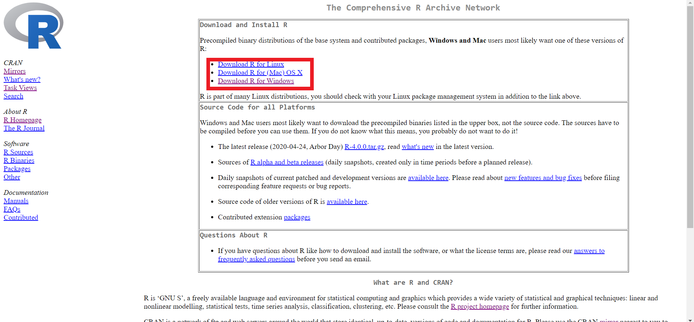
  
  - Clique em "base"
  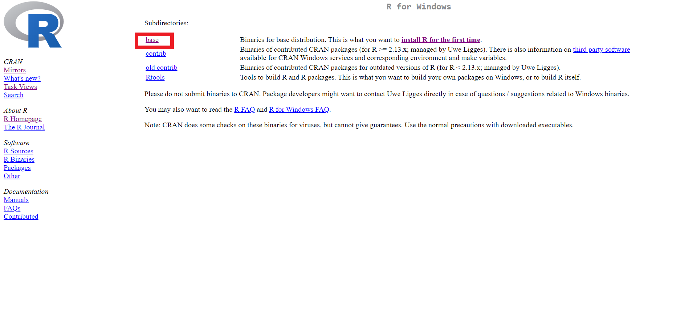
  
  - Clique para fazer o download da versão mais recente
  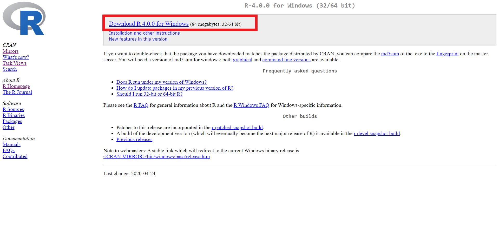
  
  - Rode o instalador e siga as instruções.
  
2. Instale o [RStudio](www.rstudio.com)
  
  - Abra o site do Rstudio e clique em **Download**
  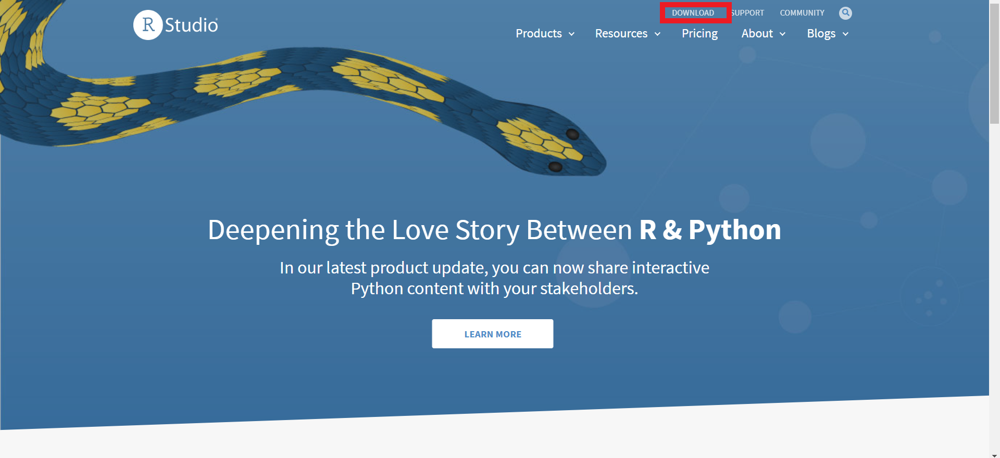
  
  - Role para baixo até chegar na parte indicada abaixo
  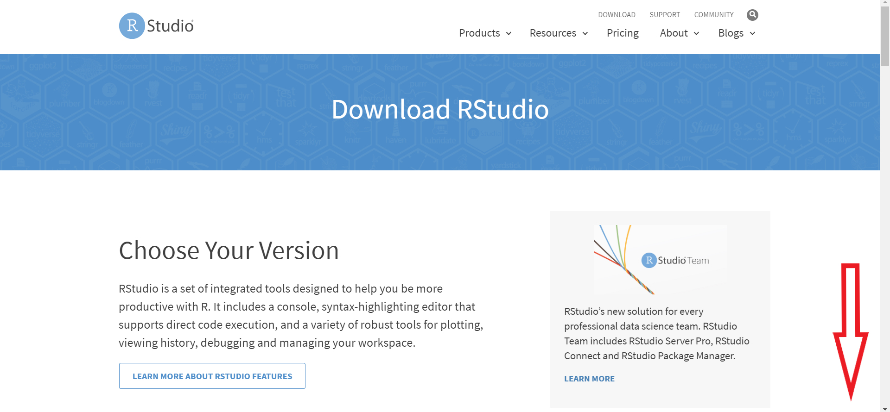
  
  - Selecione o Rstudio para usuários (gratuito)
  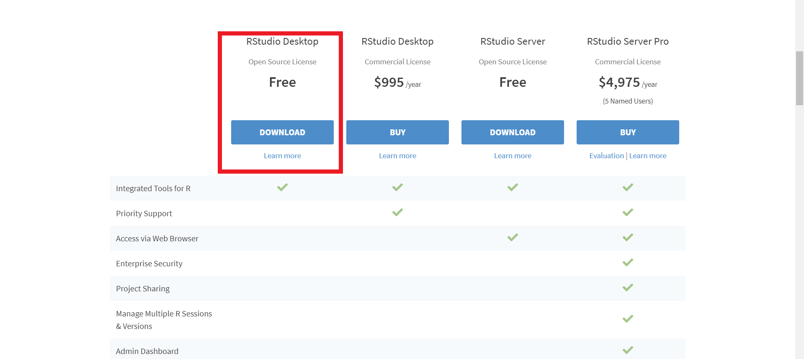
  
  - Clique no botão de download indicado
  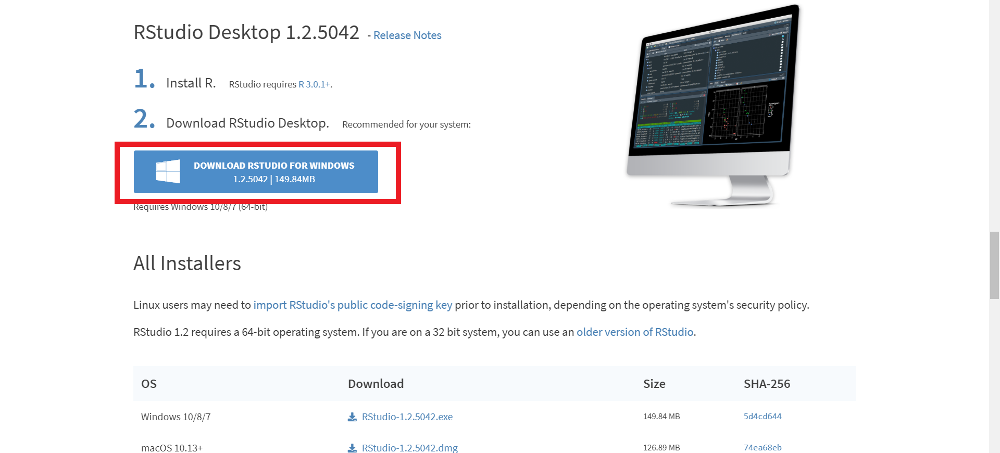
  
## O que é o R?

No contexto do uso do R na demografia, creio que é interessante a gente olhar para ele a partir de duas perspectivas:

1. É uma linguagem de programação *interpretada*, com ênfase na estatística, na ciência de dados. É muito utilizada por biológos, estatísticos e alguns cientistas sociais quantitativos, como economistas, cientistas políticos, etc.

2. É uma caixinha de ferramentas, onde muitas das operações que iremos realizar já foram programadas por outros cientistas que vieram antes de nós, o que reduz a necessidade de programar tudo manualmente.

## Pra que estudar R?

Em último caso, essa resposta é pessoal e subjetiva, afinal, como cientistas sociais ou demógrafos, existem outras opções por aí para trabalhar seus bancos de dados, mas deixo aqui algumas razões que me ajudaram a decidir.

1. R é gratuito para usuários, sem precisar comprar nem registrar nada.
2. É desenvolvido de maneira colaborativa, por cientistas, acadêmicos e programadores que doam seu trabalho para a comunidade.
3. É um dos softwares mais atualizados, recebendo novas funcionalidades o tempo todo.
4. Permite interface com todos os outros softwares estatísticos, lendo e escrevendo bancos de dados SPSS, SAS, EXCEL, STATA.
5. Um dos mais completos, com pacotes e funções para praticamente tudo que você imaginar, inclusive com alguns para a demografia.

## O Console do R

Se vocês trabalharem no console do R, ele funciona como uma espécie de calculadora científica. Para finalidades de demonstração, vou utilizar a aba "Console" do RStudio. Não é necessário abrir o software R, pois o RStudio deve conectar-se automaticamente a versão mais recente do R.

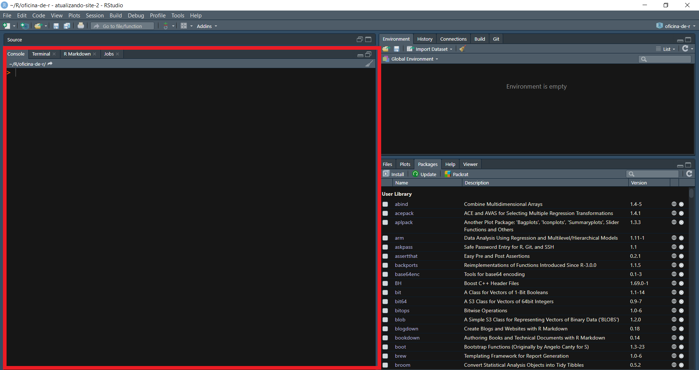

Experimente rodar (digitar e apertar ENTER) os comandos a seguir diretamente no console:

```{r}
2 + 2
2+2
2+ 2
2 +2
log(2)
log10(2)
```


```{r, eval = FALSE}
2 + 2w
```


```{r}
2 == 3
2 > 3
2 < 3
"banana"
```

Veja que alguns comandos funcionam corretamente, enquanto outros dão erros. É sempre uma boa ideia inspecionar os erros para descobrir o que está acontecendo. No caso de `2 + 2w`, o R não reconhece o `w` como algo que pode fazer parte de uma operação de soma. As `"` ao redor de banana indicam que se tratam de caracteres, o que frequentemente é chamado de *string*.

Códigos precisam ser organizados visualmente. Para o computador, tanto faz, se o código estiver correto, ele será executido sem erros, mas para o ser humano que programa, a organização do texto é fundamental. Considere o código a seguir (não o rode):

```{r, eval = FALSE}
setwd("C:/RBook/")
ISIT<-read.table("ISIT.txt",header=TRUE)
library(lattice)
xyplot(SourcesSampleDepth|factor(Station),data=ISIT,
xlab="Sample Depth",ylab="Sources",
strip=function(bg=’white’, ...)
strip.default(bg=’white’, ...),
panel = function(x, y) {
panel.grid(h=-1, v= 2)
I1<-order(x)
llines(x[I1], y[I1],col=1)})
```

Dentro de um determinado contexto, esse código funciona perfeitamente, mas para o leitor, esse código é difícil de interpretar. Mesmo sem saber do que se trata, considere as seguintes alterações:

```{r, eval = FALSE}
setwd("C:/RBook/")
ISIT<-read.table("ISIT.txt",header=TRUE)
#Comece a plotagem
#Plote Sources como função de SampleDeth, e use uma
#caixa para cada estação.
#Use a cor preta (col=1), e específique os nomes (labels)
#dos eixos x e y (xlab and ylab). Use o fundo branco nas
#caixas que contém os nomes das estações
xyplot(SourcesSampleDepth|factor(Station),
data = ISIT,xlab="Sample Depth",ylab="Sources",
strip=function(bg=’white’, ...)
strip.default(bg=’white’, ...),
panel = function(x,y) {
#Adicione linhas de grade
#Evite gráficos “espaguete”
#Plote os dados como linhas (de cor preta)
panel.grid(h=-1,v= 2)
I1<-order(x)
llines(x[I1],y[I1],col=1)})
```

A inserção de algumas linhas de comentário (iniciadas com `#`) nos ajuda a compreender qual o objetivo daquele código, o que facilita a leitura.

```{r, eval = FALSE}
#Read data
setwd("C:/RBook/")
ISIT <- read.table("ISIT.txt", header = TRUE)

#Load the lattice package
library(lattice)

#Start the actual plotting
#Plot Sources as a function of SampleDepth, and use a
#panel for each station.
#Use the colour black (col=1), and specify x and y
#labels (xlab and ylab). Use white background in the
#boxes that contain the labels for station
xyplot(Sources SampleDepth | factor(Station),
       data = ISIT,
       xlab = "Sample Depth", ylab = "Sources",
       strip = function(bg = ’white’, ...)
         strip.default(bg = ’white’, ...),
       panel = function(x, y) {
         #Add grid lines
         #Avoid spaghetti plots
         #plot the data as lines (in the colour black)
         panel.grid(h = -1, v = 2)
         I1 <- order(x)
         llines(x[I1], y[I1], col = 1)})
```

A inserção de espaços a esquerda do código (**identação**) nos ajuda a entender relações de subordinação. O que esta identado a direita está subordinado a parte não identada acima. Junto com os comentários, já se torna possível depreender um pouco mais o sentido do código. Neste caso, trata-se da leitura de um banco de dados e da construção de um gráfico (xyplot), bem como da especificação de algumas características desse gráfico.

## Porque não trabalhar diretamente no console

Quando programamos diretamente no console, estamos nos submetendo a nossa memória. Será que já executamos aquela operação? Será que já fizemos aquele passo intermediário para chegar ao resultado final? À medida que nossas tarefas se tornam mais complexas, lembrar-se de cada etapa se torna impossível. Ainda mais considerando que você deve querer salvar seus programas para reutilizá-los no futuro. Para isto, utilizaremos programas (chamados de *scripts*) que ficam abertos no painel "Source" do Rstudio. Abra seu primeiro script **clicando em File >> New File >> R Script, ou pelo atalho, Ctrl + Shift + N**.

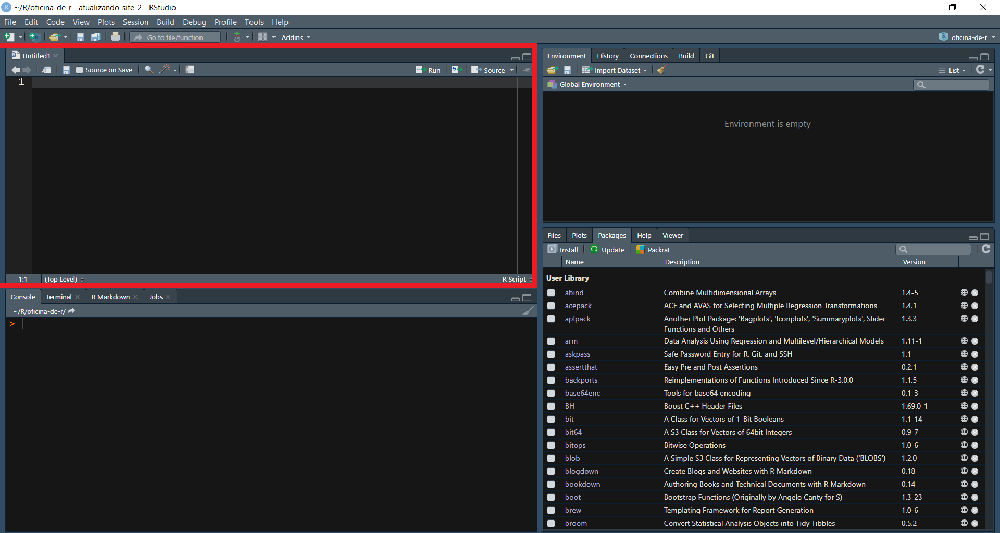

A ideia aqui é escrever um código que fica salvo em um arquivo (script) e que pode ser rodado no console usando o atalho Ctrl + Enter.

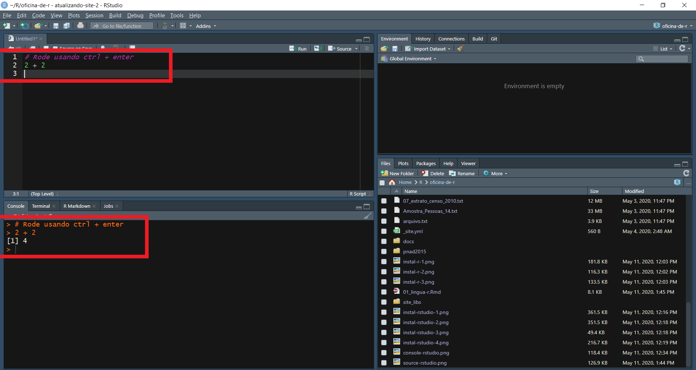

Assim, o que você estiver escrito naquela linha/bloco de código vai ser rodada e você pode ver o resultado no console embaixo.

## Ajuda do R

Uma das coisas que muda se você veio de uma Interface Gráfica de Usuário como no SPSS ou Excel, é que você precisa consultar a documentação do programa frequentemente, afinal, ninguém é um computador pra lembrar do nome de todos os comandos de cabeça. Vamos ver algumas opções no R.

Primeiro, vamos pedir ajuda sobre a função `'+'`.

```{r, eval=FALSE}
help('+')
?'+'
```

As duas opções chamam a ajuda do R, que aparece na aba Help.

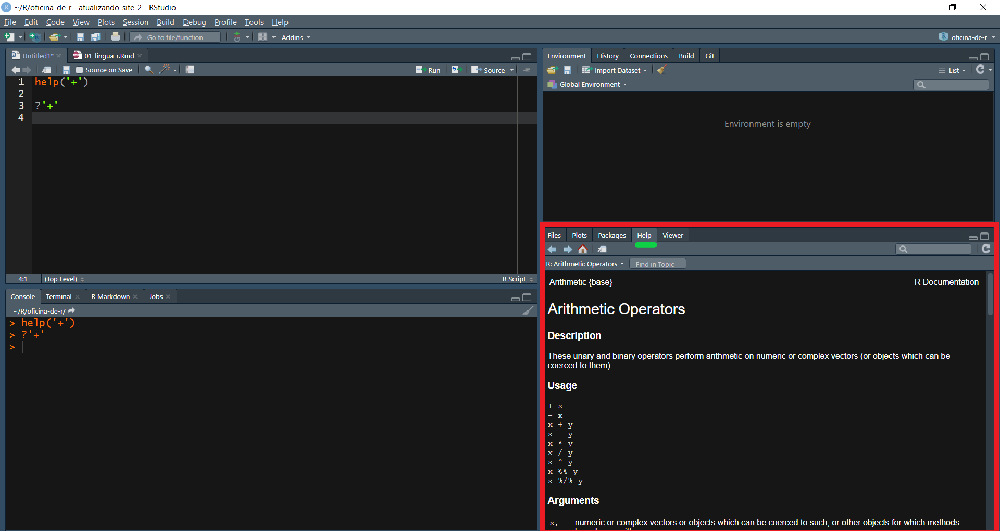

Outras opções são procurar no [Site do R](cran.r-project.com), no [Google](www.google.com.br), no [Stack Overflow](www.stackoverflow.com) ou na [Lista R-Br](http://r-br.2285057.n4.nabble.com).

Muitos pacotes no R vem com tutoriais feitos por seus criadores. Para ver uma lista de tutoriais disponíveis, use:

```{r, eval=FALSE}
browseVignettes()
```

Que deve abrir uma lista no seu navegador. Se você já sabe qual vignette quer ler, pode abrí-la diretamente no Rstudio com:

```{r, eval=FALSE}
# Substitua dplyr pelo nome da vignette
vignette("dplyr")
```

## Falando a língua do R

À medida que você começa a utilizar o R, vários termos começar a se repetir na documentação e nos fóruns, e é difícil conseguir se orientar sem saber pelo menos um pouco do seu significado e de como eles se relacionam entre si. São conceitos básicos de programação e alguns específicos da língua, então trate isso como uma aula introdutória de alemão. É difícil, mas por trás disso há uma lógica e uma comunicação eficaz (pelo menos para os alemães!).

### Síntaxe

Aqui utilizo o termo sintaxe como aquela parte da gramática que se refere a função de cada termo de uma frase e a posição adequada para este. Se eu coloco a frase: "Pizza comer adoro eu" desta forma, a maioria de vocês apontaria que seus termos estão na ordem errada. Isto ocorre porque vocês tem uma noção de como deve ser a síntaxe de uma frase em português, quem vem primeiro e quem vem depois.

Da mesma forma, no R a síntaxe é importante.

```{r}
x <- 1:10
x

sum(x)

x / sum(x)
```

A linguagem espera que as operações ocorram em uma determinada ordem, dada pelas regras estabelecidas pelos seus programadores, retiradas de convenções geralmente aceitas e também da lógica matemática. Se você receber um erro ou uma dica para "melhorar" ou "corrigir" sua sintaxe, é geralmente a isso que se refere.

### Funções e métodos

Tudo em R é feito através de funções e métodos. A melhor maneira de entender uma função é pensar em uma máquina. Vou dar o exemplo dos eletrodomésticos que temos na cozinha. O liquidificador é responsável por transformar sólidos em líquidos. Assim, ele recebe algo sólido e produz algo líquido ao final de sua operação. O fogão é responsável por cozinhar alimentos, então ele recebe alimentos crus e produz alimentos cozidos ao final da sua operação.

Assim são as funções, elas recebem entradas, nas quais executam operações específicas e emitem resultados de acordo com a função.

```{r}
# Recebe um grupo de valores e emite uma soma
sum(x)

# Recebe um grupo de valores e emite uma média
mean(x)
```

Existem diferentes tipos de liquidificadores e fogões, que são aplicados para propósitos específicos. Por exemplo, se você quer fazer um creme usando cenouras, provavelmente o seu liquidificador caseiro precisará que você coloque a cenoura já cortada em pedaços menores, pois ele não tem a potência necessária para triturar a cenoura inteira adequadamente. Por outro lado, um liquidificador industrial pode detonar uma caixa de cenouras inteira sem problema.

Essa analogia nos leva para a questão dos métodos e também das entradas das funções.

```{r}
# Emite as medidas resumo de uma variável
summary(x)

# Emite as medidas resumo de uma tabela (data.frame)
y <- letters[1:10]
df <- data.frame(x, y)
summary(df)
```

Determinadas funções só vão aceitar determinadas entradas, enquanto outras funções vão ser "genéricas", despachando o método mais adequado para o tipo de dado que você submeter.

### Argumento

Argumentos são as características que você passa pra sua função. No nosso exemplo do liquidificador, eu poderia passar 3 argumentos:

  - Os ingredientes a serem liquidificados
  - A velocidade do aparelho (1, 2 ou 3)
  - O tempo de operação em minutos
  
No caso da função soma, há um argumento opcional sobre como devem ser tratados os valores desconhecidos.

```{r}
x <- c(1:9, NA)
x

# Considere os valores NA
sum(x, na.rm = FALSE)

# Desconsidere os valores NA
sum(x, na.rm = TRUE)
```

(Quase) todas as funções recebem argumentos, e eles podem alterar o funcionamento "padrão" de uma função de acordo com as suas necessidades.

### Objetos

Na nossa empreitada culinária, precisaremos utilizar potes, panelas e depósitos para armanezar nossos ingredientes e também nossos pratos prontos. Os objetos em R são contêineres de diversos tipos e formatos nos quais podemos armazenar informações.

Vejamos um objeto que criamos agora há pouco, usando a função `<-`.

```{r}
x <- 1:10
x
```

Esse tipo de objeto se chama "vetor", e ele é geralmente uma coluna de informações de mesmo tipo, guardada em um objeto de mesmo nome. No caso, é um vetor de números inteiros que vai de 1 a 10. Há muitos tipos de objetos em R, e podemos até filosofar que tudo é um objeto, afinal, as funções são também objetos guardados numa função com seu nome. Mas isso é menos importante.

Objetos são os nossos potes e panelas, onde armazenamos informações relevantes em formatos específicos. Os dois objetos que mais utilizaremos daqui em diante são os `vetores` e os `data.frames`.

```{r}
# Vetores são criados com c()
c(1, 2, 3, 4)
c("a", "b", "c", "d")
c(TRUE, FALSE, TRUE, TRUE)

# Data.frames são criado com data.frame()
data.frame(a = c(1, 2, 3, 4),
           b = c("a", "b", "c", "d"),
           c = c(TRUE, FALSE, TRUE, TRUE))
```

### Tipos de dado

Voltando para nossa metáfora culinária, podemos encontrar diversos tipos de ingredientes. Alguns deles servem para formar a base de uma refeição, como o nosso feijão-com-arroz, enquanto outros oferecem mais sabor, como o sal e a pimenta. Outros estão entre uma coisa e outra, como o refogado de cebola, alho e cenoura.

No R, nossos objetos tem tipos distintos, alguns são números, outros são letras e palavras, outros são valores lógicos e outros são objetos complexos, compostos de vários objetos menores de vários tipos. Podemos descobrir o tipo dos objetos assim:

```{r}
# class() revela o tipo do objeto
x <- 1:10
class(x) # Vetor de inteiros

y <- letters[1:10]
class(y) # Vetores de caracteres

df <- data.frame(x, y)
class(df) # Tabela (data.frame)
```

Também podemos converter entre os tipos usando a família de funções `as.___`

```{r}
# Convertendo números
x <- c(1.1, 2.2, 3.3, 4.4)
x
as.integer(x)
as.character(x)

# Convertendo valores lógicos
y <- c(T, F, T, F)
as.numeric(y)
as.character(y)

# Nem todas as conversões são possíveis
z <- letters[1:10]
z
as.numeric(z)
```

### Algumas funções básicas muito úteis.

```{r}
# Atribuição '<-' ou '='
x <- 1
y = 2
x + y

# Concatenação 'c()'
x <- c(1, 2, 3)
y <- c(3, 2, 1)
x + y

# Médias 'mean()'
mean(x)
mean(x + y)

# Somas 'sum()'
sum(x)
sum(x - y)

# Medianas 'median()"
median(x)

# Quantis 'quantile()'
quantile(x)

# Desvio padrão 'sd()'
sd(x)

# Variância 'var()'
var(x)

# Intervalo 'range()'
range(x)

# Máximo e mínimo 'min()', 'max()'
min(x)
max(x)

# Criação de data.frame()
# A partir de valores
data.frame(a = c(1, 2, 3),
           b = c(3, 2, 1))

# A partir de vetores
data.frame(x, y)

# Colagem de caracteres (strings)
# Strings individuais
a1 <- "Eu"
a2 <- "Amo"
a3 <- "Pizza."

paste(a1, a2, a3, sep = " ")

# Vetores de strings
z <- c("Eu", "Amo", "Pizza.")

paste(z, collapse = " ")
```

## Errando

Invariavelmente, ao desenvolver seus programas, você cometerá ou encontrará erros. Não entre em pânico! Procure se informar sobre o seu erro. Localize o ponto ele ocorreu e tente ler as mensagens de erro, procure mais informações até que você consiga solucionar seu problema. Vale postar dúvidas em fóruns e ligar pro seu coleguinha que já tem mais experiência, só não vale desistir!

```{r, eval = FALSE}
# Errado
c(Palavra)
```

```{r}
# Certo
c("Palavra")
```

```{r, eval = FALSE}
# Errado
x <- c(1, 2, 3, NA)
sum(x)
```

```{r}
# Certo
x <- c(1, 2, 3, NA)
sum(x, na.rm = TRUE)
```

```{r, eval = FALSE}
# Errado
x <- c(1, 2, 3 4)
```

```{r}
# Certo
x <- c(1, 2, 3, 4)
```

No começo, pode ser difícil interpretar as mensagens de erro, mas elas geralmente oferecem pelo menos uma ideia de onde procurar o problema. Eu mesmo já resolvi vários problemas copiando e colando a mensagem no google e lendo as respostas das pessoas. Algumas são bem óbvias e tranquilas, outras são mais técnicas e complexas, mas você sempre aprende algo pelo caminho.

## Gráficos

Uma das melhores funcionalidades do R é a sua suite de visualizações. Aqui, não vamos nos deter numa explicação detalhada do funcionamento de cada parâmetro gráfico das funções, apenas demonstrar algumas funcionalidades e exemplos interessantes. Voltaremos a esse assunto no futuro. Os exemplos são adaptados do excelente [R Data Visualization Cookbook](https://www.packtpub.com/big-data-and-business-intelligence/r-data-visualization-cookbook). Os dados utilizados foram retirados do [World Bank Data](https://data.worldbank.org/).

Para que os scripts a seguir funcionem, vocês vão precisar que os arquivos de dados estejam localizados em sua pasta de trabalho, que vocês podem alterar como quiserem, basta especificar o caminho desejado de pasta.

```{r, eval = FALSE}
setwd("C:/Users/vinic/Documents/R") # Substitua pela sua pasta desejada

# OU
setwd("C:\\Users\\vinic\\Documents\\R")
```

Atenção às contrabarras se você copiar o caminho do arquivo direto do Windows!

### Um scatterplot

```{r}
if ((!"grDevices" %in% installed.packages())) {
  install.packages("ISLR")
}
library(ISLR)

attach(Carseats)

head(Carseats)

plot(Income, Sales,
     col = c(Urban),
     pch = 20,
     main = "Vendas de Cadeirinhas Infantis para automóveis",
     xlab = "Renda (milhares de Dólares)",
     ylab = "Unidades vendidas (milhares)"
)

legend("topright", 
       cex = 0.6,
       fill = c("red", "black"), 
       legend = c("Urbana", "Não-urbana"))

detach(Carseats)
```

### Um scatterplot com alguns detalhes a mais

```{r}
child = read.csv2("banco_mundial2018.csv")

summary(child)

head(child)

# Esqueleto
plot(child$gdp_bil, child$chmort, 
     pch = 20, 
     col = "#756bb1",
     xlim = c(0, max(child$gdp_bil, na.rm = TRUE)), 
     ylim = c(0, 90), 
     xlab = "PIB em Bilhões de dólares atuais", 
     ylab = "Taxa de mortalidade infantil", 
     main = "Taxa de mortalidade infantil em alguns países em 2018")

# Detalhes

abline(h = mean(child$chmort, na.rm = T), lwd = 1, col = "red")
text(19600,9,labels = c("Estados Unidos"), cex = 0.75)
text(2000, 88, labels = c("República Centroafricana"), col = "red", cex = 0.75)
text(10000, 25,labels = c("Mortalidade infantil média"), col = "red", cex = 0.75)

```

Outra versão do mesmo gráfico, com linha de tendência:

```{r}
# Linha de tendência
scatter.smooth(
  child$gdp_bil,
  child$chmort,
  span = 1/2,
  pch = 20,
  lwd = 0.75,
  col = "Blue",
  lpars = list(lty = 3, col = "black", lwd = 2),
  xlab = "PIB em Bilhões de dólares atuais",
  ylab = "Taxa de mortalidade infantil",
  main = "Taxa de mortalidade infantil em alguns países em 2018"
)
```

### Evolução temporal da desigualdade - gráfico de linha

```{r}
income <- read.csv2("banco_mundial_desigualdade.csv")

income$Year <- factor(income$Year, ordered = TRUE)

head(income)

plot(
  income$GDP_bil,
  income$gini_coef,
  pch = 20,
  col = c(income$President),
  type = "o",
  xlab = "PIB dos EUA (em bilhões de USD)",
  ylab = "Coeficiente de Gini",
  main = "Desigualdade nos EUA",
  xaxp = c(0, 18000, 8)
)

legend(
  "bottomright",
  fill = c(6, 1, 4, 2, 7, 3, 13),
  legend = c("Obama", "Bush Jr.", "Clinton", "Bush Sr.", "Reagan", 
             "Carter", "Ford"),
  bty = "n",
  cex = 0.7
)

```

### Gráfico de barras comparando valores de variáveis categóricas

```{r}
imr <- read.csv2("imr_sea_2011.csv")

head(imr)

par(mar = c(8,4,5,2))
barplot(
  imr$IMR,
  las = 2,
  names.arg = imr$Country,
  border = NA,
  ylim = c(0, 70),
  col = "#e34a33",
  main = "Taxas de mortalidade infantil na Ásia Meridional, 2011"
)
abline(h = mean(imr$IMR),
       lwd = 2,
       col = "white",
       lty = 2)
```

Essas são apenas algumas das possibilidades colocadas pelas funções gráficas do R, mas elas servem para demonstrar o quanto você pode conseguir de customização na visualização de dados e, quem sabe, estimular a curiosidade de vocês para se envolver mais com a linguagem.

## Concluindo

Este primeiro contato com a linguagem R pode ter sido um pouco complicado e difícil, caso você não tenha familiaridade com programação, mas espero que ele tenha ajudado a quebrar o gelo e tornar os conceitos um pouco mais claros, bem como que tenha demonstrado algum potencial e interesse pela linguagem.