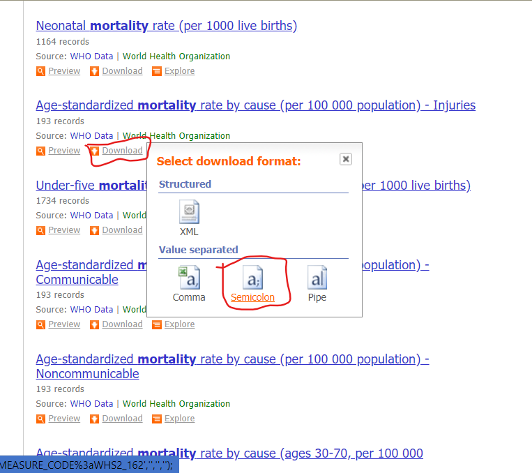
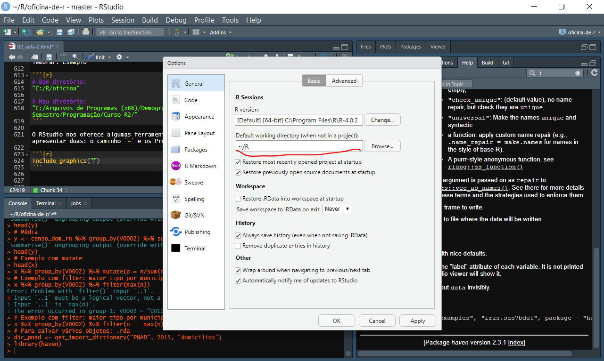
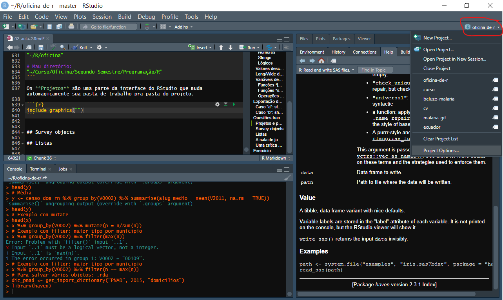
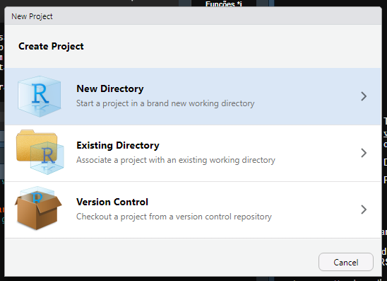
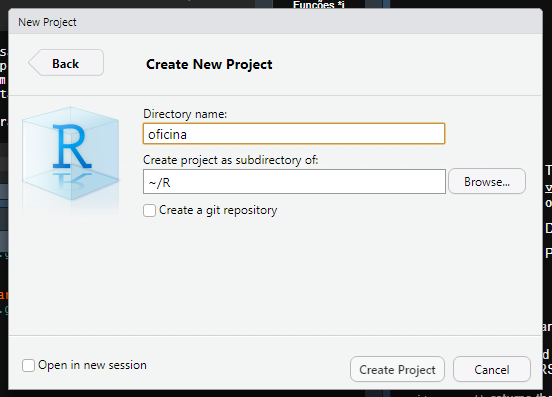

```{r setup, include=FALSE}
library(knitr)
library(rmarkdown)
library(tidyverse)
library(microdadosBrasil)
library(PNADcIBGE)
library(sidrar)
opts_chunk$set(echo = TRUE, warning = FALSE)
options(scipen = 999)
```

# Introdução

Depois da aventura enlouquecedora da primeira aula, o próximo passo lógico é a gente recuar um pouco e olhar cada uma das etapas do processo pelo qual passamos de montanha russa em queda livre com um pouco mais de cuidado, carinho e atenção. Ou raiva, desgosto e resignação, depende da *vibe*.

# Importação de diferentes tipos de bases de dados

A importação (e, por extensão, a exportação) de dados dependem basicamente da nossa capacidade de, em linhas muito gerais, entender como os dados estão organizados para poder, então, lê-los num formato com o qual a gente consiga trabalhar.

Concretamente, se sabemos que os dados estão separados por vírgulas e as colunas estão na primeira linha e as variáveis não-numéricas estão cercadas por `"`, então podemos importar estrategicamnete com base nessas regras e partir daí.

Por outro lado, se todas as variáveis estão codificadas em números sem separadores, não existe uma primeira linha com nomes de variável e a informação de importação está codificada em um outro arquivo separado do primeiro, estamos f*#$@. Brincadeira, a importação por dicionários não precisa ser um pesadelo infernal graças ao trabalho de alguns santos que vamos conhecer em breve.

## Censo Demográfico

A minha forma preferida de importação dos bancos de dados da Demografia Histórica (Censos Demográficos de 2000 e 2010 e da PNAD 1976-2015), é o pacote [microdadosBrasil][1], escrito por @lucasmation. Lucas jamais publicou seu trabalho no CRAN, então a gente precisa instalar o pacote a partir do github dele. O que é muito fácil de fazer:

```{r install-microdados, eval=FALSE}
install.packages("devtools")
devtools::install_github("lucasmation/microdadosBrasil")
```

Depois, podemos consultar os dicionários de importação de dados do Lucas (que, lamentavelmente, estão um pouco incompletos, pois ele nunca conseguiu concluir seu trabalho de sísifo).

```{r dicionarios-censo}
library(microdadosBrasil)

dic1 <- get_import_dictionary(dataset = "CENSO", 2000, "domicilios")
head(dic1)

dic2 <- get_import_dictionary(dataset = "CENSO", 2000, "pessoas")
head(dic2)

dic3 <- get_import_dictionary(dataset = "CENSO", 2010, "domicilios")
head(dic3)

dic4 <- get_import_dictionary(dataset = "CENSO", 2010, "pessoas")
head(dic4)
```

Com a ajuda dos dicionários providenciados pelo IBGE, a gente pode importar os nossos arquivos do Censo para a memória do R. Por uma questão de praticidade, vamos importar um pequeno arquivo de domicílios do Censo 2010, do RN. Vocês verão depois que é relativamente fácil expandir essa lógica pra importar o país como um todo.

```{r import-censo}
variaveis <- c("V0001", "V0002", "V0011", "V0300", "V0010", "V1006", "V2011", "V0207", "V0208", "V0401", "V6529")

nomes <- c("uf", "municipio", "areap", "controle", "peso", "sit_ru",  "v_alug", "esgoto", "agua", "n_mora")

censo_dom_rn <- read_CENSO(ft = "domicilios", i =  2010,
                           file = "Amostra_Domicilios_24.txt.xz",
                           vars_subset = variaveis)

head(censo_dom_rn)
```

Et voilá! Aí está nosso banco de dados. Se quiser importar outras variáveis do Censo, de outro estado, ou de outro estrato do dataset, é só adaptar esse processo, relativamente indolor.

## PNAD

A PNAD segue um sistema similar, mas ela exige alguns passos a mais: juntar os domicílios/pessoas e criar um objeto "survey" com pesos pós-estratificados. Numa situação real, o mais provável é que você simplesmente importe a pnad inteira. Você poderia fazer isso assim:

```{r import-pnad, eval=FALSE}
# Não execute!!! É só um exemplo!
dom <- read_PNAD(ft = "domicilios", i = 2015, file = "<seu arquivo domicilios>")
pes <- read_PNAD(ft = "pessoas", i = 2015, file = "<seu arquivo pessoas>")
```

Não é um arquivo pequeno, mas ele cabe na memória do R sem problemas. Para fins didáticos, vamos ler só o arquivo de domicílios da PNAD de 2015.

```{r import-pnad-rn}
pnad_d <- read_PNAD(ft = "domicilios", i = 2015, file = "_pnad2015/Dados/DOM2015.gz")
```

Por causa da bruxaria amostral empregada na produção das estimativas da PNAD, não podemos simplesmente calcular nossas medidas, como médias, totais, proporções. Precisamos ponderar essas medidas pelo desenho amostral e muitos de vocês vão precisar de medidas estatísticas como desvio padrão, erro, etc. Mas não temam, pois a solução está aqui [(graças ao A. J. Damico)][2]:

```{r svydesign-pnad}
options( survey.lonely.psu = "adjust" )

library(survey)

# Transformar em número a variável Projeção Populacional
pnad_d$V4609 <- as.numeric(pnad_d$V4609)

# Data frame com os valores dessa variável
pop_types <- data.frame( 
  V4609 = unique( pnad_d$V4609 ) , 
  Freq = unique( pnad_d$V4609 )
)

# Primeiro, ponderamos pelos pesos pré-estratificados
prestratified_design <- svydesign(
  id = ~ V4618 ,
  strata = ~ V4617 ,
  data = pnad_d ,
  weights = ~ V4610 ,
  nest = TRUE
)

# Agora ajustamos pela população total
pnad_design <- postStratify( 
  design = prestratified_design ,
  strata = ~ V4609 ,
  population = pop_types
)
```

Esse processo de pesagem e estratificação é complexo, e eu não finjo entendê-lo, mas com esse script na mão, vocês conseguem analisar as PNADs todas. Vou deixar no final alguns links com outros materiais que detalham melhor essa questão da amostra.

## PNAD Contínua

A PNAD Contínua possui [um pacote dedicado][3], feito por Douglas Braga, Gabriel Assunção e Luna Hidalgo. Você pode baixar a de 2018 assim:

```{r, eval=FALSE}
install.packages("PNADcIBGE")
library(PNADcIBGE)
```

```{r import-pnadc}
# Leitura offline
pnadc <- read_pnadc(microdata = "PNADC_2018_visita1.txt.xz",
                    input_txt = "input_PNADC_2018_visita1.txt")

pnadc <- pnadc_labeller(
  data_pnadc = pnadc, 
  dictionary.file = "dicionario_PNADC_microdados_2018_visita1.xls"
)

pnadc <- pnadc_design(pnadc)
```

O PNADcIBGE já deixa o objeto praticamente pronto pra análise, bom seria se a gente tivesse um desses pra outras pesquisas!

## SIDRA

O SIDRA pode já ser um velho conhecido de quem fez demografia na Unicamp, mas em geral, o processo de importação pro R era meio chato. Envolvia procurar e montar a tabela no sistema do IBGE, salvar um extrato em .CSV e depois importar com `read_csv()`, por exemplo. Felizmente, graças ao Renato Prado Siqueira, podemos cortar caminho com o pacote [sidrar][4].

```{r, eval=FALSE}
install.packages("sidrar")
library(sidrar)
```

Funciona assim, você pode circular pelo site do SIDRA e encontrar o número da sua tabela, ou usar a função:

```{r, eval=FALSE}
search_sidra("Filhos tidos pelas mulheres de 10 anos ou mais")
```

Com o número da tabela que você quer, você dá um:

```{r, eval=FALSE}
info_sidra(x = 96, wb = T)
```

Aí tem uma parte um pouco chata, que é traduzir todas opções pro R:

```{r}
filhos <- get_sidra(x = 96,
                    variable = 378,
                    period = "2010",
                    geo = "State",
                    geo.filter = list(State = 24),
                    classific = "C1",
                    category = "all")
filhos
```

A tabela é meio longa, com muitas e muitas variáveis que agente acaba não utilizando, mas o importante é que ela vem direto pro R e a gente pode selecionar só as informações que nos importam depois.

## UNData

A UN Data já tem uma API, mas ainda não existe interface pro R, então a solução é baixar os CSVs do site. 

```{r injury-png, echo=FALSE}

```


O bom é que ele já vem estruturado e a importação é tão simples quanto:

```{r import-undata}
injury <- read_csv2("UNdata-injury.txt")
head(injury)
```


# Cozinha (tidy) dos dados

Dependendo da fonte de dados, o processo de cozinha dos dados pode ser mais ou menos complexo. Ao invés de tentar criar uma lista exaustiva, vou passar uma sequência de exemplos de atividades comuns que fazemos com nossos dados, que certamente serão úteis em vários contextos.

## Tipos de dados

R entende basicamente 3 tipos de dados: números, strings e lógicos. Existem subtipos desses dados, mas são basicamente esses 3.

### Números

Podem ser inteiros, podem ser submetidos a operações matemáticas e fazer parte de testes lógicos.

```{r}
x <- censo_dom_rn$V0401[1:10]

x

class(x)

is.numeric(x)

is.integer(x)

is.double(x)

# Dê uma olhada na ajuda: ?Arithmetic

x * 10

x + 10

x >= 3

x[x >= 3]

x == 4

x[x == 4]

x != 4

x[x != 4]

```

Podem ser números reais, com casas decimais

```{r}
x <- censo_dom_rn$V0010[1:10]

x

class(x)

is.numeric(x)

is.integer(x)

is.double(x)

x ^ 2

sqrt(x)

?Comparison

x < 4.7

x == 4.898864 # números reais são durões

near(x, 4.898864, tol = 0.5)

x[x < 4.7]
```

### Strings

São sequências de caracteres alfanuméricos, geralmente estão rodeados por `"` em R. Podem ser classificados em categorias, e aí são chamados de `factors`, ou podem não ser classificados, e aí são `characters`

```{r}
x <- sample(pnadc$variables$UF, 10)

x

class(x)

is.numeric(x)

is.character(x)

is.factor(x)

y <- as.character(x)

y

class(y)
```

### Lógicos

São do tipo verdadeiro ou falso, ou 1 e 0. São principalmente usados para fazer controle de fluxo (tema de uma das próximas aulas) e para selecionar casos num banco de dados. Podem ser testados usando lógica formal (E, OU, NEGAÇÃO, IGUAL, DIFERENTE, MAIOR, MENOR, etc.)

```{r}
x <- TRUE
y <- FALSE

class(x)

is.logical(x)

as.numeric(x)
as.numeric(y)

isTRUE(x)
isFALSE(x)

# Dê um olhada na ajuda: ?Logic

x & y # e

x | y # ou

xor(x, y) # ou exclusivo

!x # negação de x

x & !y # x e a negação de y
```

Podemos converter entre tipos, quando possível:

```{r}
x <- censo_dom_rn$V0010[1:10]

x

as.integer(x)

x <- censo_dom_rn$V0001[1:10]

x

as.factor(x)

factor(x, levels = 24, labels = "Rio Grande do Norte")
```

Conversões de dados podem ser extremamente importantes para determinados aspectos da análise de dados, porque algumas funções são muito estritas e exigem que o dado esteja em um formato específico. Essa é uma das fontes de erro mais comuns em nossos scripts quando estamos começando.

## Valores desconhecidos (missing data)

Representados de diferentes maneiras, valores desconhecidos são geralmente representados no R por `NA`. Eles procuram representar a incerteza sobre o valor de alguma coisa e se comportam de acordo com essa premissa.

```{r}
x <- NA_integer_
y <- 25

x + y

sum(x + y)
sum(c(x, y), na.rm = TRUE)

x <- NA
y <- TRUE

x & y
x | y
xor(x, y)

!x
```

Em nossos bancos de dados, muitas vezes os valores são lidos como `NA`, mas as vezes, eles vem codificados de outra forma.

```{r}
# Variável númerica
x <- censo_dom_rn$V2011

summary(x)

# Variável categórica
y <- censo_dom_rn$V0207
table(y)
```

A depender da nossa definição, os 4159 valores em branco poderiam ser considerados `NA`, por serem desconhecidos. Poderíamos também, definir o valor 6 ("Outro") como `NA`, porque também representaria uma incerteza. Isso depende de um processo de reflexão crítica sobre os dados e de construção do objeto de análise. Podemos "tratar" os nossos `NA` no R de diversas formas.

```{r}
# Excluir os casos NA
pagam_aluguel <- censo_dom_rn %>% filter(!is.na(V2011))# Atente para o "!" = negação

head(pagam_aluguel)

# Transformar os casos NA em 0
aluguel0 <- censo_dom_rn %>% mutate(V2011 = ifelse(
  test = is.na(V2011), yes = 0, no = V2011
))

summary(aluguel0$V2011)

# Manter os NAs no Banco e realizar operações desconsiderando eles
mean(censo_dom_rn$V2011, na.rm = FALSE)
mean(censo_dom_rn$V2011, na.rm = TRUE)
min(censo_dom_rn$V2011, na.rm = FALSE)
min(censo_dom_rn$V2011, na.rm = TRUE)
max(censo_dom_rn$V2011, na.rm = FALSE)
max(censo_dom_rn$V2011, na.rm = TRUE)

# Definir alguns campos e valores como NA
esgoto_na <- censo_dom_rn %>% mutate(V0207 = factor(
  x = V0207, 
  # São 6 níveis + branco, mas se eu definir só 5, os outros dois viram NA
  levels = 1:5,
  labels = c("Rede geral", "Fossa sép.", "Fossa rude.", "Vala", "Rio, Lago, Mar")
))

esgoto_na %>% count(V0207)
```

## Long/Wide data

Em geral, não costumamos pensar muito em que formato os dados aparecem para nós, até o momento em que estamos tentando produzir algo específico e notamos o quanto o formato do dado nos ajuda ou atrapalha a realizar determinadas tarefas. O pacote [tidyverse][4] coloca uma grande ênfase sobre o que eles chamam de "tidy data". O que nada mais é seguir a seguinte regra: 

> Cada observação em sua linha, cada variável em sua coluna"

É uma idéia tão profundamente simples quanto ela é abstrata e confusa. Afinal, o que é uma "observação" e o que é uma "variável" pode, *rufem os tabores*, variar. Porém, visualmente, é algo bastante simples de mostrar.

```{r}
x <- esgoto_na %>% count(V0002, V0207)
head(x)
```

O banco de dados `x` é "tidy", porque para cada município, e cada tipo de esgotamento sanitário, temos um valor de n. E cada característica, ou seja, código do município, tipo de esgotamento e número de domicílios, está na sua própria variável. Contraste agora com y.

```{r}
y <- x %>% pivot_wider(names_from = V0207, values_from = n)

head(y)
```

Em y, cada linha representa um município, mas a variável "tipo de esgotamento" agora está espalhada em 6 variáveis diferentes. Outro jeito de olhar pra isso é dizer que x está na forma "longa" (long), porque ele se expande pra baixo, em número de linhas enquanto y está na forma "larga" (wide), já que ele se expande para a direita em número de colunas. A conversão de um pra outro pode ser feito com vários pacotes em R. No dplyr

```{r}
# de "longo" para "largo"
x %>% pivot_wider(names_from = V0207, values_from = n)

# de "largo" para "longo"
y %>% pivot_longer(cols = -V0002, names_to = "V0207", values_to = "n")
```

Agora, porque iriamos converter de um formato pra outro? Existem muitas razões, uma delas é facilitar computações, por exemplo. Digamos que você queria saber a proporção de domicílios em cada tipo de esgotamento sanitário.

```{r}
# No formato longo
x %>% group_by(V0002) %>% mutate(p = n/sum(n)) %>% head()

# No formato largo
y %>% mutate(total = `Rede geral` + `Fossa sép.` + `Fossa rude.` + `Rio, Lago, Mar` + Vala + `NA`,
             p_rede_geral = `Rede geral`/total,
             p_fossa_sep = `Fossa sép.`/total,
             p_fossa_rude = `Fossa rude.`/total,
             p_rio_lago_mar = `Rio, Lago, Mar`/total,
             p_vala = Vala/total,
             p_na = `NA`/total) %>% 
  head()
```

Além do trabalho extra, ainda precisaríamos resolver os `NA`s que bagunçam nossa divisão. Então, nesse caso específico, o formato longo simplifica bastante o serviço. Em outras circunstâncias, o formato largo pode ser mais recomendado.

## Variáveis derivadas e medidas resumo

É praticamente impossível que você alguma vez conduza uma análise de dados a partir do dado cru, ou bruto. Uma parte significativa do processo envolve a categorização dos dados a partir de conceitos obtidos fora do escopo do software e do banco em si. Para operacionalizar seus conceitos teóricos e tornar sua pesquisa possível, você vai precisar de dois tipos de ferramenta:

### Funções *janela*

Uma função janela executa uma operação em cada linha e devolve um valor novo com igual número de casos. No dplyr, isso é operacionalizado com `mutate`. Em geral, isso é o que chamaríamos de uma variável derivada.

```{r}
# Qual é a renda per capita do domicílio?
# V0401 = Número de moradores
# V6529 = Rendimento mensal domiciliar
com_rpc <- censo_dom_rn %>% mutate(renda_percapita = V6529 / V0401)
head(com_rpc)
```
`com_rpc` Agora tem uma nova variável para cada domicílio, derivada de duas outras variáveis, presente em cada linha do banco.

### Funções *sumário*

O outro tipo de função crucial são as funções sumário. Elas recebem qualquer número de observações, mas devolvem apenas um valor. Também as chamamos de medidas resumo. São exemplos dela médias, contagens, variâncias, desvio padrão, medianas, máximos e mínimos. No dplyr, elas são implementadas com `summaris(z)e`

```{r}
# Qual a média do número de moradores por domicílio = V0401
n_mora_dom <- censo_dom_rn %>% summarise(media = mean(V0401))
n_mora_dom
```

### Operações por grupo

Muitas vezes, não queremos uma medida resumo ou variável categórica global, mas sim uma medida para cada grupo ou "domínio", na língua dos estatísticos. Por exemplo, podemos voltar para nosso exemplo das contagens de casos por tipo de esgotamento sanitário. No dplyr, o verbo é `group_by` seguido de outro, como `mutate` ou `summarise`

```{r}
# Contagens
x <- censo_dom_rn %>% group_by(V0002, V0207) %>% summarise(n = n())
head(x)

# Média
y <- censo_dom_rn %>% group_by(V0002) %>% summarise(alug_medio = mean(V2011, na.rm = TRUE))
head(y)

# Exemplo com mutate: proporção de tipos por município = V0002
head(x)
x %>% group_by(V0002) %>% mutate(p = n/sum(n)) %>% head()

# Exemplo com filter: Tipo com maior número de casos por município
x %>% group_by(V0002) %>% filter(n == max(n)) %>% head()
```

# Exportação de dados

Nossos dados chegaram ao R, mas agora precisamos pensar em duas situações:

a. Os dados processados vão ser guardados para análises futuras (storage)
b. Os dados processados vão ser distribuídos para outras pessoas (sharing)

No caso "a" estamos em geral preocupados com evitar o retrabalho. O ideal é guardar em um formato que eu possa simplesmente importar de volta e fim, o banco está pronto para análise.

Mp casp "b", estamos preocupados com interoperabilidade: meu colaborador pode trabalhar em SAS, SPSS, Stata ou outra linguagem de programação, então faz sentido eu querer exportar em outros formatos, embora eu não esteja super preocupado em evitar o retrabalho. Talvez meu colaborador precise ralar um pouco.

Input/Output ou I/O ou IO é você se preocupar e pensar um pouco sobre esse processo. Vou oferecer uma solução simplificada operacional pra gente.

### Caso "a": storage

Salve tudo em formato `.Rds` ou `.Rda`.

```{r, eval=FALSE}
# Para salvar um único objeto: .rds
saveRDS(object = pnadc, file = "pnadc_pronta_pro_combate.rds")

# Para ler um .rds, readRDS()
readRDS("pnadc_pronta_pro_combate.rds")

# Para salvar vários objetos: .rda
dic_pnad <- get_import_dictionary("PNAD", 2015, "domicilios")
save(dic_pnad, pnad_design, file = "pnad_2015_com_dicionario.rda")

# Para ler um .rda, load()
load("pnad_2015_com_dicionario.rda")
```

### Caso "b": sharing

Alguns pacotes como `foreign` e `haven` pode importar e exportar vários formatos utilizados por outros softwares.

```{r, eval=FALSE}
# Apenas exemplo, não precisa rodar!
install.packages("haven")
library(haven)
# SPSS
read_spss(file = "<seu arquivo>", user_na = FALSE, col_select = NULL, skip = 0, n_max = Inf, .name_repair = "unique")

write_sav(data = seu_objeto, path = "<arquivo>.sav", compress = FALSE)

# SAS
read_sas(data_file = "<seu arquivo>",
         catalog_file = "<seu catálogo>",
         encoding = NULL,
         catalog_encoding = encoding,
         col_select = NULL,
         skip = 0L,
         n_max = Inf)

write_sas(data = seu_objeto, path = "<arquivo>.sas7bdat")

# Stata
read_dta(file = "<seu arquivo",
         encoding = NULL,
         col_select = NULL,
         skip = 0,
         n_max = Inf,
         .name_repair = "unique")

write_dta(data = seu_objeto,
          path = "<arquivo>.dta",
          version = 14,
          label = NULL)

# CSV: write_csv ou write_csv2
# write_csv = separador ",", decimal "."
write_csv(x = seu_objeto,
          path = "<arquivo>.csv",
          na = "NA",
          append = FALSE,
          col_names = !append,
          quote_escape = "double")

# write_csv2 = separador ";", decimal ","
write_csv2(x = seu_objeto,
           path = "<arquivo>.csv",
           na = "NA",
           append = FALSE,
           col_names = !append,
           quote_escape = "double")

```

# Questões transversais

## Projetos e pastas

Em geral, não queremos ficar muito tempo trabalhando com caminhos de arquivos muito complicados. O ideal é você ter sua pasta do R perto do diretório raíz e lá dentro você criar pastas com nomes curtos e fáceis de lembrar. Exemplo

```{r}
# Bom diretório:
"C:/R/oficina"

# Mau diretório:
"C:/Arquivos de Programas (x86)/Demografia/Segundo Semestre/Programação/Curso R2/"
```

O RStudio nos oferece algumas ferramentas pra gerenciar diretórios. Vou apresentar duas: o caminho `~` e os Projetos.

```{r, echo=FALSE}

```

O `~` é um atalho pra sua pasta pessoal de documentos, e é um forma de encurtar o longo caminho entre a raíz C: do Windows e a sua pasta pessoal, caso você não queira deixar uma pasta na raíz do computador (por exemplo, em computadores compartilhados do NEPO).

```{r}
# Bom diretório:
"~/R/oficina"

# Mau diretório:
"~/Curso/Oficina/Segundo Semestre/Programação/R"
```

Os **Projetos** são uma parte da interface do RStudio que muda automagicamente sua pasta de trabalho pra pasta do projeto.

```{r, echo=FALSE}

```

Ao criar um novo projeto, e abrir uma sessão no RStudio em um projeto, ele muda a pasta de trabalho para a pasta do projeto. Essa feature tem um potencial enorme para outras coisas também, mas só pelo fato dela já mudar a pasta de trabalho, ela já é útil imediatamente pra quem tá começando.

Vocês podem inclusive criar um projeto para o curso:

```{r, out.width='50%', echo=FALSE}


```

## Survey objects e amostragem

Os objetos survey tem uma família de funções específicas pra trabalhar com eles, que começam com `svy`. São bem tranquilas de usar uma vez que você conhece a síntaxe, mas em geral, elas são muito mais lentas que funções comuns, porque calculam as fontes de erro amostral junto com os resultados.

```{r svy-example, eval=FALSE}
# Média do rendimento bruto mensal (V403312)
svymean(formula = ~V403312, design = pnadc, na.rm = TRUE)

# Média do rendimento bruto mensal por sexo (V403312, V2007)
svyby(formula = ~V403312, by = ~V2007, design = pnadc, FUN = svymean, na.rm = TRUE)
```

Outras funções do pacote são `svyboxplot(), svytotal(), svychisq(), svyglm(), svyplot(), svyvar()` etc, com uma lógica similar.

O pacote survey foi inventado por Thomas Lumley, que escreveu um [livro apenas sobre cálculo amostral][5], que eu entendi uns 5% quando li. É um assunto sôfrego, acho que até quem sabe fica triste só de pensar nisso. De todo jeito, a referência que usei pra aula é o script do [Damico][2].

## Listas

Listas são uma forma de armazenar dados com estruturas não retangulares em R. Em geral, a gente evita trabalhar com elas, pois são complexas e pouco intuitivas. Porém, se você for obrigado, [esse material aqui][6] dá um show.

## A sala de jantar: o que vêm depois da cozinha

É um pouco estranho interromper um tutorial de R "no meio" do processo de análise de dados, torna tudo meio abstrato e parece que não estamos indo a lugar nenhum, mas pra poder construir gráficos e tabulações complexas amanhã, precisamos dominar alguns conceitos básicos imprescindíveis que foram introduzidos hoje. Quem ficou com gostinho de quero mais, por favor siga para os tutoriais sobre [visualização][7], [manipulação][8] e [reformatação][9] do meu site.

## Uma crítica ao modelo de ciência de dados e o ofício de um cientista de dados

Na primeira aula antecipei que o modelo de ciência de dados apresentado tinha duas lacunas:

> Um processo de reflexão crítica sobre a produção de dados

e

> Um enfoque teórico bem definido

Quero elaborar melhor esses dois pontos.

Qualquer pessoa que abra um banco de dados grande, como o censo demográfico, vai encontrar ali dezenas de informações sobre uma dúzia de temas. Sem um processo de reflexão crítica sobre a produção dos dados, você pode rapidamente produzir uma série de análises vazias de sentido, com um viés preconceituoso, mas muito esteticamente bonitas e aparentemente "corretas", afinal, como gostam de dizer alguns criminosos por aí: "os dados não mentem". Por isso, é essencial que o analista procure alicerçar suas análises de dados sobre o trabalho de seus pares, sobre a literatura e sobre as pesquisas que vão além dos dados. Se não, na melhor das hipóteses você fica perdido nos dados, e, na pior, você produz pseudociência e desinformação.

O segundo ponto é uma exigência para avançar o nosso entendimento das questões sociais. Mesmo com um processo de reflexão crítica sobre as informações presentes nos dados, ainda estamos no nível da descrição da realidade. Qual o valor de dizer que um número subiu ou desceu, que existe um número n de uma categoria x? Provavelmente, muito pouco. Os dados exigem perguntas de pesquisa bem fundamentadas em um paradigma teórico, que faz previsões sobre os eventos que serão medidos e permite interpretar os resultados dentro de uma chave. Por isso, os pesquisadores do NEPO costumam chamar atenção para o aspecto **teórico-metodológico** do trabalho com os dados, algo que frequentemente está ausente entre alguns cientistas de dados. Para uma reflexão interessante sobre os perigos e possibilidades dessa era de "revolução dos dados", [leiam esse artigo aqui.][10]

# Exercício

Utilizando a PNAD contínua (`PNADC_2018_visita1.txt.xz`) e seus arquivos de apoio, crie uma rotina para importar dados demográficos (idade e sexo da população), e socioeconômicos (anos de estudo e rendimento mensal domiciliar per capita).

- Importação e tratamento inicial dos dados
- Criação do objeto survey
- Conversão para factors
- Tratamento dos missings
- Conversão de long para wide data

[1]: https://github.com/lucasmation/microdadosBrasil
[2]: http://asdfree.com/pesquisa-nacional-por-amostra-de-domicilios-pnad.html
[3]: https://rpubs.com/BragaDouglas/335574
[4]: https://cran.r-project.org/web/packages/sidrar/vignettes/Introduction_to_sidrar.html
[5]: https://r-survey.r-forge.r-project.org/svybook/
[6]: https://adv-r.hadley.nz/vectors-chap.html#lists
[7]: https://zlkrvsm.github.io/Oficina-de-R/14_visualizacoes-em-R.html
[8]: https://zlkrvsm.github.io/Oficina-de-R/15_manipulacao-dplyr.html
[9]: https://zlkrvsm.github.io/Oficina-de-R/16_tidy_data.html
[10]: https://link.springer.com/article/10.1007/s13524-018-0715-2#Tab1