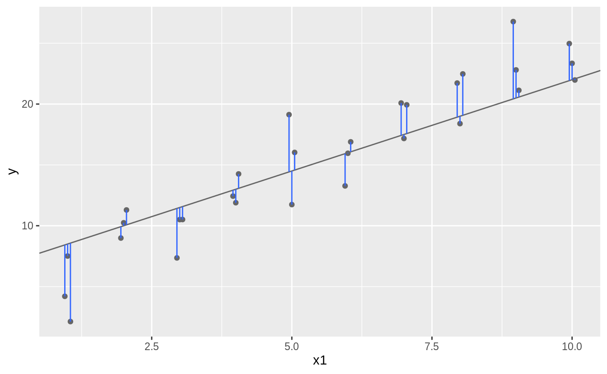

```{r setup, include=FALSE}
library(knitr)
library(rmarkdown)
opts_chunk$set(echo = TRUE, warning = FALSE)
options(scipen = 999)
```

# Introdução

O foco da aula de hoje é a produção de visualizações. Vamos estudar formas de transformar nossos dados em visualizações. Isto envolve um processo inicial de transformação dos dados e, posteriormente, podemos "mapear" os valores do dados para elementos visuais. Vamos começar.

# Visualizações básicas

Vamos ver algumas formas de mapear os nossos dados para o espaço visual, mas, para isso, precisamos entender a "gramática" dos gráficos. Vejam a imagem a seguir, retirada do livro [ggplot2: Elegant Graphics for Data Analysis][1], de Hadley Wickham

```{r, echo=FALSE}
include_graphics("scale-guides.png")
```

Um gráfico é uma forma de mapear os dados em um sistema de medidas. Por exemplo,
se eu tenho duas variáveis numéricas, como "Idade" e "Renda per capita", eu posso mapear os valores para um eixo de coordenadas cartesianas (do tipo x,y) e,
para cada uma das observações do meu banco, eu desenho um ponto na posição indicada pelos eixos X e Y. Isso é um scatterplot clássico.

## Scatterplots

```{r scatterplot}
library(tidyverse)

censo <- read_csv2("censo_sc.csv.xz")

# Primeiro vamos recortar nossos dados para evitar que os outliers atrapalhem a visualização da tendência.

summary(censo)

censo2 <- censo %>% filter(!is.na(renda_pc) & renda_pc < 20000)

# r base
with(
  censo2,
  plot.default(x = idade, y = renda_pc, type = "p",
       main = "Scatterplot",
       xlab = "Idade",
       ylab = "Renda Per capita")
)

# ggplot2
censo2 %>% 
  ggplot(aes(x = idade, y = renda_pc)) + geom_point() +
  labs(x = "Idade", y = "Renda Per Capita", title = "Scatterplot")
```

Nosso mapeamento não produz uma visualização muito informativa, porque há muitos pontos no gráfico, o que nos dificulta distinguir onde estão as tendências. Esse tipo de problema é conhecido como "overplotting". Há muitas soluções distintas para esse problema. Uma delas, é a gente deixar os pontos mais translúcidos, para que as zonas onde há mais pontos se destaquem em relação a onde há poucos pontos.

```{r scatterplot2}
library(scales)

# r base
color <- rgb(red = 0, green = 0, blue = 0, alpha = 0.1)

with(
  censo2,
  plot.default(x = idade, y = renda_pc, type = "p",
       main = "Scatterplot",
       xlab = "Idade",
       ylab = "Renda Per capita",
       col = color)
)

# ggplot2
censo2 %>% 
  ggplot(aes(x = idade, y = renda_pc)) + geom_point(alpha = 0.2) +
  labs(x = "Idade", y = "Renda Per Capita", title = "Scatterplot")
```

Um pouco melhor, podemos ver que a nuvem é um pouco mais alta e mais densa nas idades produtivas, mas ainda está muito poluído. E se a gente retirasse uma medida resumo para cada município? Reduziriamos o número de pontos e talvez pudessemos ter uma noção mais clara. Pode ser a média de idade e a média da renda per capita.

```{r scatterplot3}
medias <- censo2 %>%
  group_by(mun7) %>% 
  summarise(
    idade_media = mean(idade),
    renda_pc_med = mean(renda_pc)                          
  )

# r base
with(
  medias,
  plot.default(x = idade_media, y = renda_pc_med, type = "p",
       main = "Scatterplot",
       xlab = "Idade",
       ylab = "Renda Per capita")
)

# ggplot2
medias %>% 
  ggplot(aes(x = idade_media, y = renda_pc_med)) + geom_point() +
  labs(x = "Idade", y = "Renda Per Capita", title = "Scatterplot")
```

Agora sim. Em geral, nossa nuvem de pontos não deve ser muito densa, se não a gente não consegue distinguir as feições do nosso grupo de dados. Para isso, podemos recorrer tanto a técnicas visuais, quanto a transformações nos dados.

Mas não é só isso. Além de mapear valores para eixos, podemos também mapear valores para outros atributos estéticos. Por exemplo, podemos mapear o sexo da pessoa para as cores dos pontos.

```{r scatterplot4}
medias_sexo <- censo2 %>%
  group_by(mun7, sexo) %>% 
  summarise(
    idade_media = mean(idade),
    renda_pc_med = mean(renda_pc)                          
  )

# r base
color <- c("Feminino" = "red", "Masculino" = "blue")

with(
  medias_sexo,
  {
  plot.default(x = idade_media, y = renda_pc_med, type = "p",
       main = "Scatterplot",
       xlab = "Idade",
       ylab = "Renda Per capita",
       col = color)
  legend(x = "topleft", legend = c("Feminino", "Masculino"), fill = color)  
  }
)
# ggplot2
medias_sexo %>% 
  ggplot(aes(x = idade_media, y = renda_pc_med, color = sexo)) +
  geom_point() +
  labs(x = "Idade", y = "Renda Per Capita", title = "Scatterplot")

```

Legal, né?

## Lines

Gráficos de linhas são uma forma interessante de verificar alterações em alguma variável ao longo do tempo, por exemplo. São a forma preferencial de visualizar séries temporais. Em geral, eu evito tentar produzir séries temporais a partir de microdados, dá um trabalhão! Podemos conseguir séries temporais no IBGE, no SIDRA, por exemplo. O gráfico de linhas é muito similar ao de pontos, mas os pontos são conectados por linhas para indicar que pertencem todos ao mesmo grupo.

```{r linhas}
library(sidrar)
search_sidra("Fecundidade")

info_sidra(1163) #wb = TRUE

fecun <- get_sidra(x = 1163,
                  variable = 2493,
                  period = "all",
                  classific = "C1",
                  category = list(C1 = c(1, 2)))
fecun <- fecun %>% select(`Situação do domicílio`, Ano, Valor)

# Mapeando a situação do domicílio para COR
fecun %>% 
  ggplot(aes(x = Ano, y = Valor, color = `Situação do domicílio`, group = `Situação do domicílio`)) +
  geom_line() +
  labs(x = "Ano", y = "Taxa de fecundidade total", title = "Lineplot COR")

# Mapeando a situação do domicílio para tipo de linha
fecun %>% 
  ggplot(aes(x = Ano, y = Valor, linetype = `Situação do domicílio`, group = `Situação do domicílio`)) +
  geom_line() +
  labs(x = "Ano", y = "Taxa de fecundidade total", title = "Lineplot COR")
```

## Density plots

Parecido com o histograma, os density plots são uma forma de visualizar uma variável contínua através da sua distribuição de probabilidades.

```{r density}
censo %>% 
  ggplot(aes(x = idade, color = sexo)) +
  geom_density(outline.type = "upper") +
  labs(x = "Idade", y = "Probabilidade", title = "Density Plot")
```

## Barplots and Histograms

Ao invés de probabilidades, podemos usar contagens e proporções, que são empilhadas no formato de barras para fazer histogramas e barplots.

```{r histogram}
censo %>% 
  ggplot(aes(x = idade, fill = sexo)) +
  geom_histogram(position = "dodge", binwidth = 5) +
  labs(x = "Idade", y = "Contagem", title = "Histograma")
```

Num barplot, a altura das barras é proporcional ao número de casos em cada posição, similar ao histograma. A diferença é que ele não agrupa os valores. O legal é que ela vem com um argumento "weight", que permite utilizar a ponderação pela variável peso.

```{r barplot}
censo %>% 
  ggplot(aes(x = idade, fill = sexo, weight = peso)) +
  geom_bar(position = "dodge") +
  labs(x = "Idade", y = "Contagem", title = "Barplot")
```

O `ggplot2` tem mais um tipo de gráfico de barras, que é o `geom_col()`. Nesse caso, você tem que passar uma variável que já contenha a altura das barras, ele não calcula por você.

```{r geom-col}
proporcao <- censo %>% 
  count(sexo, idade, wt = peso) %>% 
  mutate(p = n/sum(n))
proporcao

proporcao %>% 
  ggplot(aes(x = idade, y = p, fill = sexo)) +
  geom_col(position = "dodge") +
  labs(x = "Idade", y = "Proporção", title = "Colplot") +
  scale_y_continuous(labels = label_percent())

```


## Visualizando incerteza

Existem gráficos no ggplot2 que nos ajudam a visualizar incerteza, mostrando uma margem de erro, ou intervalo de confiança. Podemos calcular, por exemplo, a idade média da população brasileira, por estado, pesquisada pela PNAD Contínua, em 2018.

```{r errorbarh}
library(survey)

pnadc <- readRDS("pnadC-Subarq-1.rds")

# Calcule a idade média ponderada
idade_media <- svyby(
  ~ V2009,
  by = ~ UF,
  design = pnadc,
  FUN = svymean,
  na.rm.all = TRUE
)
# Calcule os intervalos de confiança
idade_media <- confint(idade_media) %>% as.data.frame() %>% rownames_to_column("UF")
idade_media

# Hora do gráfico
idade_media %>% 
  ggplot(aes(xmin = `2.5 %`, xmax = `97.5 %`, y = UF)) +
  geom_errorbarh()
```

## Mapas

Mapas exigem que a gente entre numa seara complexa. A forma como os objetos no espaço são representados não é algo trivial de se introduzir em tão pouco tempo. Em linhas muito gerais, o R guarda informações sobre as formas geométricas dos objetos na forma pontos, linhas, polígonos e coleções destas formas. O pacote principal para trabalhar com dados espaciais é o `sf` ([Pebesma et al. 2020][2]). O IBGE tem uma API só para você baixar as malhas espaciais deles, e graças ao [Rafael Pereira e colaboradores][3], a gente pode importar essas malhas com um mínimo de esforço, usando o pacote `geobr`.

```{r mapa}
library(sf)
library(geobr)

# Importe o arquivo com as informações dos estados
uf_mapa <- read_state()
uf_mapa

# Mapa básico
uf_mapa %>% 
  ggplot() +
  geom_sf() +
  geom_sf_text(aes(label = name_state))

# Quando queremos associar outras informações ao mapa, precisamos recorrer a joins
renda <- svyby(~VD5011, by = ~UF, design = pnadc, FUN = svymean, na.rm = TRUE)
renda

#Join do mapa com a informação sobre renda média das ufs
join <- left_join(uf_mapa, renda, by = c("name_state" = "UF"))
join

# Mapa coroplético de renda
join %>% 
  ggplot() +
  geom_sf(aes(fill = VD5011))
```

# Modelos

Modelos estatísticos são uma forma de medir os efeitos de determinadas variáveis, as vezes chamadas de covariáveis, variáveis independentes, etc. - em uma variável resposta, ou variável dependente, que é a nossa variável de interesse. Também podem ser usados para explorar os dados e descobrir padrões, ou como uma ajuda na visualização de bancos de dados complexos e pouco estruturados.

## Introdução

Modelagem é um assunto complexo e sobre o qual existe uma vasta literatura. Meu objetivo aqui é que vocês entendam o que é um modelo e como ele é construído, pois os modelos demográficos apresentados nas disciplinas de Análise Demográfica seguem as mesmas regras.

1. Primeiro, você define uma família de modelos que poderiam se ajustar aos seus dados. Aqui, vamos usar uma família de modelos lineares simples. Até porque eu não entendo muito dessas coisas.

2. Depois, você tenta ajustar um modelo específico, que, a partir de alguns testes, você consegue determinar que é o mais adequado aos seus dados.

Os modelos são, por definição, **incorretos e falsos**, pois eles são apenas a melhor aproximação possível de um fenômeno real complexo. Nem por isso eles deixam de ser **úteis**, o importante é que tanto você quanto o seu público entendam o **potencial** e os **limites** do modelo.

> All models are wrong, but some are useful.  
George Box

## Um exemplo simples de modelo linear

Para entender como os modelos funcionam, podemos voltar para aquela nossa nuvem de pontos que relacionava a idade média com a renda per capita.

```{r model1}
g <- medias_sexo %>% 
  ggplot(aes(x = idade_media, y = renda_pc_med)) +
  geom_point() +
  labs(x = "Idade", y = "Renda Per Capita", title = "Scatterplot")
g
```

Não está muito claro pra nós, mas a gente poderia esticar nossa imaginação e dizer que existe uma relação **linear** entre idade e renda per capita. Mas como essa relação linear seria definida? Em outras palavras, se eu sei que existe um modelo linear pra essa relação, que modelo é esse e como eu poderia encontrá-lo?

Uma primeira tentativa, seria a gente chutar. Com computadores é fácil chutar muitas possibilidades.

```{r model2}
modelos <- tibble(
  a1 = runif(500, 300, 1800),
  a2 = runif(500, -50, 50)
)

g + geom_abline(aes(intercept = a1, slope = a2), data = modelos, alpha = 1/4)

```

Se nos colocássemos o exercício de determinar qual dessas linhas melhor representa a relação entre renda per capita e idade, provavelmente chegaríamos a conclusão de que a maioria desses modelos é muito ruim! Mas que estratégia poderíamos adotar para escolher um modelo melhor?

```{r, echo=FALSE}

```

Uma estratégia eficiente é você encontrar uma linha que tinha as menores distâncias possíveis em relação aos pontos. Essa distância é a diferença entre o valor dado pelo modelo (**valor predito**) e o valor real do dado (**valor resposta**). Pra fazer a conta dessa distância, podemos definir uma nova função que faz essa conta. Novamente, estamos **calculando a distância entre o valor predito pelo modelo e o valor real do dado**!

A função vai receber dois parâmetros, um são os nossos **coeficientes** do modelo, que descrevem a curva matemática no formato $a_1x + a_2$. O outro é o nosso dado.

```{r model3}
# Definição da função
model1 <- function(a, data) {
  a[1] + data$renda_pc_med * a[2]
}

# Cálculo das distâncias
model1(c(200, -0.5), medias_sexo)[1:10]

```

Ok, mas ainda não resolvemos nosso problema! Essa função calcula um número de distâncias igual ao número de pontos. Algumas distâncias podem ser menores em dado modelo, mas muito maiores em outro. Precisamos de uma medida global que nos diga a distância. A solução adotada pelos estatísticos é o **root-mean-squared-error**. Ou seja, você calcula a diferença entre o **valor real** e o **valor predito**, eleva ela ao quadrado, tira sua média e depois tira sua raíz quadrada. Essa sequência repetitiva de operações é perfeita para um função!

```{r model4}
measure_distance <- function(mod, data) {
  diff <- data$renda_pc_med - model1(mod, data) # Calcula as diferenças!
  sqrt(mean(diff ^ 2)) # eleva ao quadrado, tira a média, tira a raíz
}

# Vocês podem brincar com os parâmetros do modelo e ver se a distância aumenta ou diminui
measure_distance(c(200, -0.5), medias_sexo)
measure_distance(c(250, 0.5), medias_sexo)
measure_distance(c(250, 1), medias_sexo)
```

Ok, agora que temos essas ferramentas na mão, podemos calcular as distâncias **root mean squared error** pra todos os modelos que inventamos.

```{r model5}
# Mais uma função! Essa calcula a distância entre os parâmetros do modelo e o valor real
renda_dist <- function(a1, a2) {
  measure_distance(c(a1, a2), medias_sexo)
}

modelos <- modelos %>% 
  mutate(dist = map2_dbl(.x = a1, .y =  a2, ~ renda_dist(.x, .y)))
modelos
```

Que tal a gente ver o nosso progresso até agora colocando os melhores modelos em relação aos nossos dados?

```{r model6}
# Selecionando os 10 melhores modelos (menor distância)
melhores <- modelos %>% filter(rank(dist) <= 10)

# Gráfico
g + geom_abline(
  aes(intercept = a1, slope = a2, color = -dist),
  data = melhores
)
```

Como vocês podem ver, conseguimos identificar alguns modelos que representam melhor a relação entre idade e renda. Isso não significa que encontramos o modelo correto, ou que essa relação é verdadeira, pois isso precisa ser construído como argumento, fundamentado em evidência. Mas esse é um processo através do qual você pode chegar a um modelo.

## Modelando em R

Em geral, não é necessário repetir esse processo manual de modelagem. Através de algoritmos já implementados em R, podemos implementar um modelo linear com poucas linhas de códigos. É importante, no entanto, que a gente entenda o que está acontecendo "por debaixo do capô", por isso inclui essa explicação longa. Agora, vamos ver como encontraríamos um modelo linear usando o R.

```{r model-r}
modelo_renda <- lm(formula = renda_pc_med ~ idade_media, data = medias_sexo)
summary(modelo_renda)
```

A interpretação correta de um modelo envolve um bom conhecimento de tópicos da estatística, como a análise de regressão linear, análise dos valores preditos, análise dos resíduos, dos p-valores, e muitas outras coisas. O que gostaria que vocês levassem daqui é uma ideia geral sobre o que os modelos são e como são construídos, e como eles podem ser implementados em R sem muita dificuldade. Pra encerrar, vamos ver nosso modelo lado a lado com os dados.

```{r model-smooth}
g + geom_smooth(method = "lm", formula = y ~ x)
```

Quem quiser aprender mais sobre modelagem, eu recomendo [o capítulo sobre modelos][4] do R for Data Science, que é bem didático. Precisa ter um pouquinho de background sobre funções, mas também dá pra aprender muita coisa no próprio livro.

# Exercício

## Construção de variáveis derivadas de idade

## Gráficos para exploração dos dados

## Um modelo linear de renda por anos de estudo

[1]: https://ggplot2-book.org
[2]: https://cran.r-project.org/web/packages/sf/vignettes/sf1.html
[3]: https://cran.r-project.org/web/packages/geobr/vignettes/intro_to_geobr.html
[4]: https://r4ds.had.co.nz/model-basics.html